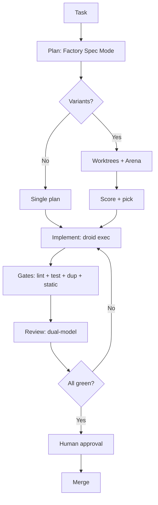

# 2026-02-15-plan-workflow-optimization

**Status:** NOT_STARTED
**Created:** 2026-02-15
**Source:** Research document "Optimizing Workflows Across AI Coding Platforms"
**Deep Analysis Completed:** 2026-02-15

---

## Goal

Implement missing workflow optimizations identified in the research document to achieve faster, lower-cost, near-flawless code generation across Windsurf Cascade, Factory Droid, and potential Traycer integration.

---

## DONE WHEN

- [ ] All P0 gaps addressed
- [ ] All P1 gaps addressed
- [ ] Workflow end-to-end tested
- [ ] KPIs measurable
- [ ] **Spec-Level Implementation Plan (implementable specs) attached** (each GAP has a runnable deterministic gate + DONE criteria + artifacts list)

---

## Spec Index

> **"Attached"** means spec is implementation-ready:
> 1. **Artifacts table exists** — Path | Action | Purpose | Gate Coverage
> 2. **Canonical gate exists** — Single copy/paste bash command that exits 0 on success
> 3. **DONE WHEN maps to gate** — Completion criteria verified by gate output
> 4. **Scope boundaries declared** — Explicit IN SCOPE / NOT IN SCOPE lists

| GAP | Spec File | Status |
|-----|-----------|--------|
| GAP-01 | `2026-02-16-spec-gap01-duplicate-detection.md` | SPEC |
| GAP-02 | `2026-02-16-spec-gap02-windsurf-workflows.md` | SPEC |
| GAP-03 | `2026-02-16-spec-gap03-mcp-server-config.md` | SPEC |
| GAP-04 | `2026-02-16-spec-gap04-kpi-dashboard.md` | SPEC |
| GAP-06 | `2026-02-16-spec-gap06-custom-droids.md` | SPEC |
| GAP-07 | `2026-02-16-spec-gap07-traycer-integration.md` | SPEC |
| GAP-08 | `2026-02-16-spec-gap08-property-testing.md` | SPEC |
| GAP-09 | `2026-02-16-spec-gap09-pipeline-orchestrator.md` | SPEC |

### Implementation Order (Tentative)

1. **GAP-01** — Duplicate Detection (foundation for quality gates)
2. **GAP-09** — Pipeline Orchestrator (enables automated execution)
3. **GAP-04** — KPI Dashboard (measurement infrastructure)
4. **GAP-02** — Windsurf Workflows (IDE integration)
5. **GAP-03** — MCP Server Config (external tool access)
6. **GAP-06** — Custom Droids (specialized agents)
7. **GAP-08** — Property Testing (advanced test coverage)
8. **GAP-07** — Traycer Integration (evaluation only)

---

## Executive Summary

### Current State (COMPREHENSIVE - Deep Analysis)

#### ✅ FULLY IMPLEMENTED (Strong Foundation)

| Category | Implementation | Details |
|----------|----------------|---------|
| **AGENTS.md** | ✅ Root + nested | 684 lines, comprehensive execution protocol |
| **Windsurf Rules** | ✅ 7 rules | `00-critical.md` through `90-automation.md`, proper activation modes |
| **Factory Hooks** | ✅ 16 hooks | PreToolUse, PostToolUse, SessionStart, Notification - all active |
| **Factory Custom Droids** | ✅ 3 droids | `code-reviewer`, `worker`, `service-migrator` with full YAML+prompt |
| **Factory Skills** | ✅ 12 skills FULLY IMPLEMENTED | All have SKILL.md with detailed instructions (NOT empty!) |
| **Session Management** | ✅ droid_session.py | Token tracking, billing cycle, quota, 451 lines |
| **Model Safety** | ✅ Price multiplier validation | `get_model_price()`, `is_model_safe_for_auto()` |
| **Enforcement Scripts** | ✅ 15 scripts | env_vars, secrets, health, docker, ports, watchdog, plans, structure, changelog |
| **Code Review** | ✅ Dual-model droid-review.sh | Uses meta-prompt, P0/P1 output, one-test recommendation |
| **Pre-commit Hooks** | ✅ 12 hooks | ruff, mypy, bandit, fabrik-conventions, ai-quick-review, cascade-backup |
| **Spec Pipeline** | ✅ 3-stage | idea → scope → spec templates in `templates/spec-pipeline/` |
| **Traycer Templates** | ✅ Ready to use | `templates/traycer/` with plan, execution, verification templates |
| **Scaffold System** | ✅ Full project generator | `fabrik.scaffold.create_project()` with all conventions |
| **SaaS Skeleton** | ✅ Next.js 14 template | Full marketing + app pages, SSE streaming |
| **Container Registry** | ✅ `container_images.py` | Search, ARM64 check, Trueforge images |
| **Cascade Backup** | ✅ Auto-sync | Memories + global rules exported to docs/reference/ |
| **Process Monitor** | ✅ Long command tracking | `rund`, `rundsh`, `runc`, `runk` scripts |

#### ⚠️ PARTIALLY IMPLEMENTED

| Category | Status | Gap |
|----------|--------|-----|
| **Windsurf Workflows** | ❌ No `.windsurf/workflows/` directory | Research recommends reusable workflow files |
| **MCP Servers** | ❌ Empty `mcp.json` | No external tool integrations |
| **Orchestrator** | 🚧 In development | `specs/FABRIK_CONSOLIDATED_GAP_ANALYSIS.md` identifies this as P0 |

#### ❌ NOT IMPLEMENTED (Research Recommendations)

| Category | Research Recommendation | Priority |
|----------|------------------------|----------|
| **Duplication Detection** | jscpd/PMD CPD in pre-commit + CI | P0 |
| **Worktree Isolation** | Git worktrees for parallel variants | P1 |
| **Arena Mode** | Multi-model parallel exploration | P1 |
| **Property-Based Testing** | Hypothesis for edge cases | P2 |
| **Mutation Testing** | mutmut/Stryker for test quality | P2 |
| **Semgrep Rules** | Custom semantic analysis | P2 |
| **KPI Dashboard** | Cycle time, cost per PR | P1 |

---

## Gap Analysis: Research vs Implementation

### P0 GAPS (Critical - Must Fix)

#### GAP-01: No Duplicate Detection

**Research says:**
> "Use a duplication detector such as jscpd or PMD CPD. Add to pre-commit and CI."

**Current state:** No duplicate detection. Risk of agents re-implementing existing functionality.

**Implementation:**
1. Add `jscpd` to pre-commit config
2. Add to CI pipeline
3. Create enforcement check `check_duplicates.py`

**Effort:** 2-4 hours

---

#### GAP-02: No Worktree/Variant Isolation

**Research says:**
> "Use git worktrees. Windsurf supports worktrees for parallel Cascade tasks. Arena Mode runs multiple models in separate sessions/worktrees."

**Current state:** All work happens in main worktree. No parallel variant exploration.

**Implementation:**
1. Document worktree workflow in `docs/guides/worktree-workflow.md`
2. Create `scripts/worktree-manager.sh` for easy worktree creation
3. Add rule to `.windsurf/rules/` for variant isolation
4. Test Arena Mode integration

**Effort:** 4-6 hours

---

#### GAP-03: No Spec-First Planning Enforcement

**Research says:**
> "Always require a plan artifact (file-level, with risk notes) before implementation. Factory Specification Mode offers 'plan before changes' guarantee."

**Current state:** Plans exist in `docs/development/plans/` but creation is manual. No enforcement that plans exist before coding.

**Implementation:**
1. Add `check_plan_exists.py` enforcement
2. Create Factory skill `fabrik-plan-first` that auto-creates plan
3. Add Cascade rule requiring plan document for features
4. Integrate with `--use-spec` flag

**Effort:** 4-6 hours

---

#### GAP-04: Missing KPI Instrumentation

**Research says:**
> "Measure cycle time, iteration count, cost per merged PR, quality gates, prompt-rule compliance."

**Current state:** Token tracking exists but no aggregated KPIs. No dashboard.

**Implementation:**
1. Create `scripts/kpi_tracker.py` that aggregates:
   - Cycle time (commit → merge)
   - Token cost per task (from droid_session.py)
   - Iteration count (review cycles)
   - Gate pass rate
2. Add `/kpi` endpoint or CLI command
3. Store in `.droid/kpis.jsonl`

**Effort:** 6-8 hours

---

### P1 GAPS (High Priority)

#### ~~GAP-05: Empty Factory Skills~~ **CORRECTED - ALREADY IMPLEMENTED**

**Deep analysis found:** All 12 Factory skills ARE fully implemented with detailed SKILL.md files:
- `fabrik-scaffold/SKILL.md` (199 lines) - Complete project generation
- `fabrik-docker/SKILL.md` (181 lines) - Docker/Compose conventions
- `fabrik-health-endpoint/SKILL.md` (194 lines) - Health check patterns
- `fabrik-saas-scaffold/SKILL.md` - SaaS template usage
- `fabrik-config/SKILL.md` - Environment configuration
- `fabrik-preflight/SKILL.md` - Deployment readiness
- `fabrik-api-endpoint/SKILL.md` - API patterns
- `fabrik-watchdog/SKILL.md` - Auto-restart scripts
- `fabrik-postgres/SKILL.md` - Database patterns
- `fabrik-documentation/SKILL.md` - Doc generation
- `fabrik-test-generator/SKILL.md` - Test creation
- `documentation-generator/SKILL.md` - General docs

**NO ACTION NEEDED** - This gap does not exist.

---

#### GAP-06: Limited Custom Droids (REVISED)

**Research says:**
> "Custom droids carry system prompt + model + tooling policy."

**Current state:** 3 basic droids:
- `code-reviewer` - Basic review instructions
- `worker` - Generic worker
- `service-migrator` - Migration helper

**Missing droids:**
- `planner` - Spec-first planning
- `security-auditor` - Security scanning
- `test-generator` - Test creation
- `documentation-writer` - Doc updates

**Implementation:**
1. Create 4 new droids with full specifications
2. Add model + tools restrictions
3. Document in `docs/reference/custom-droids.md`

**Effort:** 3-4 hours

---

#### GAP-07: No Traycer Integration

**Research says:**
> "Traycer as Planner + Verifier, Factory as Implementer, Windsurf as IDE surface."

**Current state:** No Traycer. Using Cascade + Factory only.

**Implementation:**
1. Evaluate Traycer for spec-driven development
2. If adopted: Configure MCP integration
3. Create workflow: Traycer plan → Factory implement → Traycer verify

**Effort:** 8-12 hours (evaluation + integration)

---

#### GAP-08: No Property-Based/Mutation Testing

**Research says:**
> "Property-based testing (Hypothesis) generates edge cases. Mutation testing evaluates test quality."

**Current state:** Standard pytest only. No property-based or mutation testing.

**Implementation:**
1. Add `hypothesis` to requirements
2. Create example property tests
3. Evaluate `mutmut` or `cosmic-ray` for Python mutation testing
4. Add to CI as optional quality gate

**Effort:** 4-6 hours

---

#### GAP-09: MCP Servers Not Configured

**Research says:**
> "MCP connects agents to external tools. Factory supports MCP servers with allowlisting."

**Current state:** `~/.factory/mcp.json` is empty (`{"mcpServers": {}}`).

**Implementation:**
1. Identify useful MCP servers:
   - GitHub MCP (PR/issue management)
   - Database MCP (schema introspection)
   - Docker MCP (container management)
2. Configure in `mcp.json`
3. Test tool availability in droid sessions

**Effort:** 2-4 hours

---

### P2 GAPS (Nice to Have)

#### GAP-10: No Environment Snapshot at Session Start

**Research says:**
> "Create a script that prints repo root, branch, package managers, versions, installed deps. Run in SessionStart hook."

**Current state:** `session-context.py` does basic project detection but no full env snapshot.

**Implementation:**
1. Enhance `session-context.py` with:
   - Python version + venv detection
   - Node version + package versions
   - Docker status
   - Git branch + recent commits
2. Add to SessionStart output

**Effort:** 2-3 hours

---

#### GAP-11: No Semantic Presence Checks (Semgrep)

**Research says:**
> "Use Semgrep to identify patterns and enforce 'do not re-implement X' rules."

**Current state:** Using ruff/mypy for linting but no Semgrep.

**Implementation:**
1. Add Semgrep to CI
2. Create Fabrik-specific rules for:
   - Duplicate utility functions
   - Security patterns
   - Architecture violations
3. Add pre-commit hook (optional, may be slow)

**Effort:** 4-6 hours

---

#### GAP-12: No Formal Variant Scoring

**Research says:**
> "Rank variants with rubric: complexity, risk, verification burden, runtime cost."

**Current state:** Manual comparison of approaches.

**Implementation:**
1. Create variant scoring template in `templates/variant-scorecard.md`
2. Add to planning workflow
3. Document in AGENTS.md

**Effort:** 1-2 hours

---

## Implementation Priority

### Phase 1: Foundation (Week 1)
1. GAP-01: Duplicate detection (jscpd)
2. GAP-03: Spec-first enforcement
3. GAP-05: Populate Factory skills

### Phase 2: Isolation & Metrics (Week 2)
4. GAP-02: Worktree workflow
5. GAP-04: KPI tracking
6. GAP-06: Additional custom droids

### Phase 3: Advanced (Week 3+)
7. GAP-08: Property/mutation testing
8. GAP-09: MCP servers
9. GAP-11: Semgrep rules
10. GAP-07: Traycer evaluation (if desired)

---

## Out of Scope

- Windsurf PR Reviews (requires Teams/Enterprise)
- OSS-Fuzz integration (overkill for current scale)
- Full policy-as-code with OPA/Conftest (existing enforcement sufficient)

---

## Research Document Key Insights

### The "State Ladder" Pattern
```
1. AGENTS.md (repo conventions)
2. Windsurf Rules (IDE-level)
3. Factory Custom Droids (role-specific)
4. Session Tools (/compress, /fork)
5. ADRs (decisions)
```

### Tiered Model Strategy
| Phase | Model Type | Cost |
|-------|-----------|------|
| Explore | Fast Context / gemini-flash | 0.2× |
| Plan | High reasoning (claude-sonnet) | 1.2× |
| Implement | Balanced (gpt-5.1-codex) | 0.5× |
| Verify | Tools, not prose (tests + /review) | varies |

### Pipeline Over Prompting
> "Failure modes are best treated as pipeline problems, not prompting problems."

Key insight: Move from "instructions in chat" to "tool-enforced guardrails":
- Pre-commit hooks
- CI gates
- Factory hooks that block on violations
- Automated verification before human review

---

## Recommended Workflow (Target State)



---

## Files to Create/Modify

### New Files
- `scripts/enforcement/check_duplicates.py`
- `scripts/worktree_manager.py`
- `scripts/kpi_tracker.py`
- `docs/guides/worktree-workflow.md`
- `docs/reference/custom-droids.md`
- `templates/variant-scorecard.md`
- `.factory/skills/*/skill.md` (12 files)
- `.factory/droids/planner.md`
- `.factory/droids/security-auditor.md`
- `.factory/droids/test-generator.md`
- `.factory/droids/documentation-writer.md`

### Modified Files
- `.pre-commit-config.yaml` - Add jscpd
- `~/.factory/mcp.json` - Add MCP servers
- `~/.factory/hooks/session-context.py` - Enhanced env snapshot
- `.windsurf/rules/00-critical.md` - Add spec-first requirement
- `AGENTS.md` - Add variant scoring reference

---

## Success Metrics

| Metric | Current | Target |
|--------|---------|--------|
| Duplicate implementations per month | Unknown | 0 |
| Code review iterations | ~3 | ≤2 |
| Time to first green CI | Unknown | Track |
| Token cost per merged PR | Unknown | Track & optimize |
| Gate pass rate (first attempt) | Unknown | >80% |

---

## References

- Research: `docs/reference/Optimizing Workflows Across AI Coding Platforms...md`
- Factory Docs: `~/.factory/FactoryAI_Docs.md`
- Current hooks: `~/.factory/settings.json`
- Current rules: `.windsurf/rules/`
