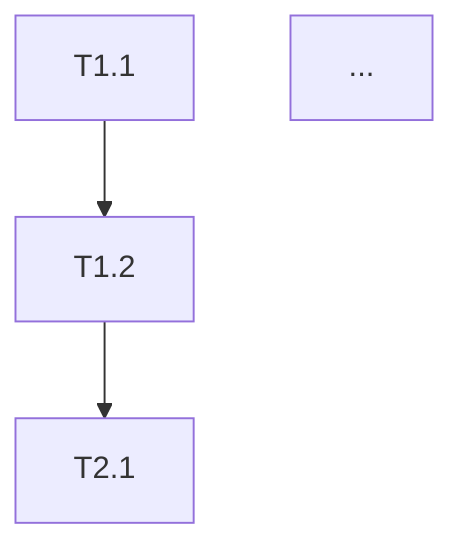

# Stage 2: Spec → Traycer Planning

After your discovery session produces a complete spec, use this prompt with Traycer or Factory Droid to generate the implementation plan.

---

## TRAYCER PLANNING PROMPT

```
I have a complete product specification. Convert it into a phased implementation plan that Windsurf Cascade can execute step-by-step.

## Rules for Planning

1. **Phases** = Major milestones (3-6 total)
   - Each phase produces something demoable
   - Phase 1 is always: project setup + core infrastructure
   - Last phase is always: polish, testing, deployment

2. **Tasks** = Work units within a phase (3-8 per phase)
   - Each task is completable in 1-4 hours
   - Each task has clear acceptance criteria
   - Tasks within a phase can be done in sequence

3. **Steps** = Atomic instructions within a task (3-10 per task)
   - Each step is a single action
   - Steps include exact file paths when relevant
   - Steps include exact commands when relevant

4. **Every task prompt MUST include a Mode Header**
   - Stage
   - Current Mode
   - Spec Status (Frozen)
   - Scope (Task X.Y only)

5. **Every task MUST end with a verification instruction**
   - Explicitly state that Mode 4 (Verify) is required after implementation
   - Verification is performed using **Factory Droid (GPT-5.1-Codex-Max)**

6. **Every task prompt MUST include the Before-Writing-Code Protocol**
   - GOAL, PLAN, DEPLOY, ISSUES, CONFIRM
   - This is required by windsurfrules

## Output Format

### Output 1: tasks.md (for project root)

Generate tasks.md in this exact format (per windsurfrules):

```markdown
# Project: [name]

## Phase 1: [Phase Name]
- [ ] Task 1.1: [Task Name]
  - [ ] [Subtask 1]
  - [ ] [Subtask 2]
- [ ] Task 1.2: [Task Name]
  - [ ] [Subtask 1]
  - [ ] [Subtask 2]

## Phase 2: [Phase Name]
- [ ] Task 2.1: [Task Name]
  - [ ] [Subtask 1]
  - [ ] [Subtask 2]

## Phase 3: [Phase Name]
...
```

### Output 2: IMPLEMENTATION_PLAN.md (for plan/ folder)

```markdown
# [PROJECT NAME] - Implementation Plan

## Phase 1: Foundation
**Goal**: [what's demoable after this phase]
**Estimated Time**: [X hours]

### Task 1.1: [Task Name]

**Mode Header**:
```
Stage: 3 — Execution
Current Mode: Mode 3 — Build
Spec Status: Frozen
Scope: Task 1.1 only
Next Required Step: Mode 4 — Verify with Factory Droid (Codex-Max)
```

**Before-Writing-Code Protocol**:
```
GOAL: [one sentence outcome]
PLAN: [tools/libs chosen; why; key risks]
DEPLOY: [WSL | VPS Docker | Supabase] — Will config work in all targets?
ISSUES: "Known issues for [tool]? If yes, list now."
CONFIRM: "Proceed?" → Wait for explicit "yes"
```

**Acceptance Criteria**:
- [ ] [specific, testable criterion]
- [ ] [specific, testable criterion]

**Steps**:
1. [exact action]
2. [exact action]
...

**Files Created/Modified**:
- `/opt/<project>/path/to/file.py` - [purpose]

**Self-Review Checklist** (run before marking done):
- [ ] Does it handle edge cases? (empty input, null, errors)
- [ ] Any hardcoded values that should be config?
- [ ] Security issues? (exposed secrets, injection, etc.)
- [ ] Will it break existing functionality?
- [ ] DOCS UPDATED? (schema→database.md, API→api.md, config→CONFIGURATION.md)

**After completing this task, the next step is mandatory:**
→ Run Mode 4 — Verify using Factory Droid (GPT-5.1-Codex-Max)

---

### Task 1.2: [Task Name]

**Mode Header**:
```
Stage: 3 — Execution
Current Mode: Mode 3 — Build
Spec Status: Frozen
Scope: Task 1.2 only
Next Required Step: Mode 4 — Verify with Factory Droid (Codex-Max)
```

[... same structure ...]

---

## Phase 2: [Phase Name]
**Goal**: [what's demoable]
**Estimated Time**: [X hours]
**Dependencies**: Phase 1 complete

### Task 2.1: [Task Name]
...
```

### Output 3: Individual Task Prompts (for plan/task_prompts/)

For each task, generate a standalone file `task_X.Y.md`:

```markdown
Stage: 3 — Execution
Current Mode: Mode 3 — Build
Spec Status: Frozen
Scope: Task X.Y only
Next Required Step: Mode 4 — Verify with Factory Droid (Codex-Max)

---

## Task X.Y: [Name]

### Before-Writing-Code Protocol

```
GOAL: [one sentence outcome]
PLAN: [tools/libs chosen; why; key risks]
DEPLOY: [WSL | VPS Docker | Supabase] — Will config work in all targets?
ISSUES: "Known issues for [tool]? If yes, list now."
CONFIRM: "Proceed?" → Wait for explicit "yes"
```

### Context
**Project**: [name]
**Project Root**: `/opt/<project>/`
**Spec Location**: `/opt/<project>/spec_out/`
**Current State**: 
- [what files/features exist from previous tasks]
- [what's working]

### Goal
[One sentence: what this task achieves]

### Reference Docs
Read these before starting:
- `spec_out/SPEC.md` - Section [X] for requirements
- `spec_out/DataModel.md` - Entity: [Z] for data model

### Steps
1. [Exact action with file paths]
2. [Exact action]
3. [Exact action]
...

### Acceptance Criteria
- [ ] [Specific testable criterion]
- [ ] [Specific testable criterion]
- [ ] [Specific testable criterion]

### Constraints (from windsurfrules)
- Do NOT modify files outside this task's scope
- Do NOT add features not in the spec
- Do NOT refactor existing code unless required for this task
- NEVER hardcode `localhost` — use `os.getenv('DB_HOST', 'localhost')`
- NEVER use `/tmp/` — use project-local `.tmp/` or `.cache/`
- Health checks MUST test actual dependencies
- Ask if anything is unclear before proceeding

### Self-Review Checklist
Run before marking done:
- [ ] Does it handle edge cases?
- [ ] Any hardcoded values that should be config?
- [ ] Security issues?
- [ ] Will it break existing functionality?
- [ ] `ruff check .` passes
- [ ] `mypy .` passes
- [ ] DOCS UPDATED?

### When Done
Report:
1. Files created/modified (list with one-line description)
2. How to test (exact commands or steps)
3. Any deviations from spec (explain why)
4. Any blockers for next task

---

After completing this task, the next step is mandatory:
→ Run Mode 4 — Verify using Factory Droid (GPT-5.1-Codex-Max)
```

## Additional Outputs

After the implementation plan, also generate:

### 1. Task Dependency Graph (Mermaid)


### 2. Risk Checkpoints
After which tasks should we pause and verify before continuing?

### 3. Credentials Checklist
List any API keys/credentials needed:

| Credential | When Needed | Add to Project .env | Add to /opt/fabrik/.env |
|------------|-------------|---------------------|-------------------------|
| [API_KEY] | Task X.Y | ✓ | ✓ |

### 4. Port Registration
If project needs ports:

| Port | Service | Purpose |
|------|---------|---------|
| [port] | [service] | [purpose] |

Check `/opt/_project_management/PORTS.md` for conflicts before assigning.

## Here's My Spec

[PASTE YOUR COMPLETE SPEC FROM STAGE 1 HERE]
```

---

## How to Use

1. Complete Stage 1 discovery → get the full spec document
2. Open Traycer (or Factory Droid with `droid exec`)
3. Paste this prompt + your spec
4. Tool generates the phased plan
5. Save outputs:
   - `tasks.md` → `/opt/<project>/tasks.md`
   - `IMPLEMENTATION_PLAN.md` → `/opt/<project>/plan/`
   - Individual task prompts → `/opt/<project>/plan/task_prompts/`
6. Execute tasks one-by-one in Windsurf Cascade
