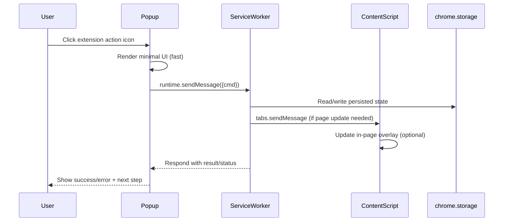

# Modern GUI Approaches for Chrome Extensions

## Executive summary

Modern Chrome-extension GUIs succeed when they treat each UI surface (popup, side panel, options, content-script overlays) as a distinct product with its own lifecycle, constraints, and performance budget—especially under Manifest V3 (MV3), where a service worker replaces persistent background pages and can terminate when idle. citeturn17view0turn34view0

A “flawless” extension GUI is usually the combination of: (a) a ruthlessly focused primary task flow (one primary CTA; everything else deferred), (b) architecture that prevents UI jank (off-main-thread work, minimal DOM & CSS, lazy loading), (c) MV3-safe build and CSP posture (no inline scripts/eval; no remotely hosted executable code), and (d) accessible-by-default interaction patterns (native controls, robust focus management, ARIA only when needed). citeturn9search4turn33search10turn16view0turn34view0turn7search6turn7search1

A strong default “modern + lean + scalable” build approach is to treat the extension as a multi-entrypoint web app (popup/options/side-panel/content-scripts/service-worker) and use a build toolchain that understands extensions and MV3 constraints. Vite-based extension tooling (e.g., CRXJS) exists specifically because “every file in the manifest” must be bundled/copied correctly and because HMR in extension contexts is non-trivial. citeturn5search3turn5search4turn11view0

**DONE (verifiable outcome):** You have (1) an MV3 reference architecture + folder structure you can scaffold locally, (2) bundle-size budgets you can verify by inspecting build artifacts, (3) accessibility and performance checklists you can validate with keyboard-only testing + DevTools performance profiling, and (4) UI pattern choices tied to official Chrome constraints (popup auto-closes; side panel requires permission and behaves like an extension page). citeturn33search10turn39search1turn7search6turn8search6

## UI and UX principles that consistently produce “least confusing” extension GUIs

High-performing extension GUIs largely follow established usability heuristics—particularly “visibility of system status,” “match between system and the real world,” “error prevention,” and “aesthetic and minimalist design.” citeturn9search4turn9search12 The practical translation for extensions is:

**Result-first information hierarchy.** In a popup or side panel, default to a single clear primary action and show the current state of “this page / this selection / this account.” This aligns with keeping users informed (system status) and reducing cognitive load. citeturn9search4turn33search10

**Progressive disclosure for power features.** Extensions often grow into “Swiss army knife” tools; progressive disclosure delays advanced controls into secondary screens (options page, “advanced” accordion, overflow menu) so the primary surface remains fast and obvious. citeturn9search6turn6search3

**Target sizing and interaction efficiency.** On small UIs (especially popups), prioritize large hit targets and avoid dense control clusters; Fitts’ Law models speed/accuracy tradeoffs and strongly favors larger, nearer targets for rapid selection. citeturn9search3

**Predictable escape hatches.** Users should always have a clear way to cancel/close a transient UI and undo destructive actions—especially because popups close automatically when focus shifts. Design flows so closing the popup cannot leave the system in a confusing “half state.” citeturn33search10turn9search4

**Extension-specific clarity: “what data do you touch?”** Extensions are high-trust software; the UI should reflect least privilege (what permissions are requested and why) and provide obvious in-product disclosure for sensitive flows, consistent with Chrome Web Store privacy and permission requirements. citeturn14view0turn13search1turn13search9

## Chrome extension UI surfaces and MV3 constraints that shape GUI design

### UI surface comparison and when each is “most effective”

| UI surface | Best for | Key UX strengths | Hard constraints that affect GUI design |
|---|---|---|---|
| Action popup | Quick, single-step tasks; “status + action” | Instant access from toolbar; good for small workflows | Auto-closes when focus leaves the popup; no way to keep it open after click-away. citeturn33search10 Size constraints exist in Chrome (historically documented as max 800×600 for toolbar-action popup). citeturn33search0turn33search13 |
| Side panel | Persistent “companion” UI (notes, bookmarks, assistants) | More space; stays alongside browsing; can be “always available” while user navigates | Requires `"sidePanel"` permission. citeturn39search1 Side panel content is an extension page (has extension APIs like other extension pages). citeturn39search1turn16view0 |
| Options page | Settings, onboarding, advanced configuration | Large canvas; users expect “preferences” here | Users reach it via extension Details → Options (and other entry points); design for discoverability (link from popup). citeturn6search3turn6search1 |
| Content-script UI overlay (in-page) | Contextual UI on specific pages/selections | “Right where the work happens”; can feel magical if non-intrusive | Content scripts run in an isolated world (JS isolation) but still share the page DOM; CSS conflicts are common unless you adopt isolation (e.g., Shadow DOM). citeturn35search2turn35search1 |

### MV3 architecture constraints that directly impact GUI architecture

**Service worker replaces persistent background pages.** MV3 moves the background context to a service worker that runs only when needed, which changes how you manage state and long-running work. citeturn17view0turn34view0

Key practical implications for GUI design and responsiveness:

* **No DOM in the service worker**; DOM/window-dependent logic must live in an extension page or an offscreen document. citeturn17view0
* **Service workers can terminate when idle**, so you must persist state instead of relying on in-memory globals; timers may be cut short and should be replaced with alarms for scheduled work. citeturn17view0
* **Executable code must be packaged**: MV3 disallows remotely hosted code; you can only execute JavaScript included in the extension package. citeturn34view0

### CSP and “modern build” constraints that make or break frameworks

Chrome enforces a minimum CSP for extension pages; it cannot be relaxed to include `unsafe-eval`, and the default policy forbids inline JS/eval and only allows local scripts (`script-src 'self'`). citeturn16view0 This has two large GUI engineering consequences:

1) Your extension UI should be built so it **does not require inline scripts** and works under extension-page CSP. citeturn16view0
2) Your dev/build pipeline must avoid approaches that rely on `eval`-style devtools in production bundles, because extension-page CSP can’t be loosened to allow them. citeturn16view0

## Lean UI technology choices for extensions

### Frameworks comparison for extension GUIs

The table below uses two size signals: (a) library/package size where directly available, and (b) a small “bundle (gzip)” signal from a Vite-based component-size benchmark that built and compressed comparable sample apps across frameworks (useful because it reflects what ends up shipped, not just package metadata). citeturn32view0turn41search0turn3search11

| Approach | Ship size signal (credible source) | Performance-relevant model | Extension-fit notes |
|---|---:|---|---|
| Vanilla JS + native Web Platform (custom elements optional) | No framework runtime by definition | You control DOM updates; easiest to keep tiny | Best when scope is small and you can enforce strict component discipline. Pairs well with Shadow DOM isolation for content-script overlays (if you implement it). citeturn35search1turn16view0 |
| Preact | Preact site positions it as “small.” citeturn26search18 Component-size benchmark: preact “bundle (gzip)” ≈ 6,584 bytes for its test app. citeturn32view0 | Virtual DOM, React-like component model | Strong choice for lean popups and medium UIs when you want React-style ergonomics with smaller shipped bundles (per benchmark). citeturn32view0 |
| Svelte (modern) | Component-size benchmark: svelte5 “bundle (gzip)” ≈ 9,076 bytes in the test app. citeturn32view0 Benchmark findings: Svelte 5 shows a larger base runtime than Svelte 4 but smaller per-component growth. citeturn28view0 | Compiler-first; generates JS; runtime tradeoffs depend on version | Particularly attractive for extensions that will grow in UI complexity because bundle growth behavior can matter as you add components. citeturn28view0turn32view0 |
| Lit (Web Components) | Bundlephobia: lit v3.2.1 ≈ 5.8 kB (min+gzip). citeturn41search0 | Web Components with templating & reactive updates | Great for content-script overlays due to Shadow DOM encapsulation patterns; Lit docs emphasize Shadow DOM usage for encapsulation. citeturn35search10turn41search0 |
| React (optimized) | Bundlephobia: react v19.2.0 ≈ 2.8 kB (min+gzip). citeturn3search11 Component-size benchmark: react “bundle (gzip)” ≈ 59,256 bytes in its test app. citeturn32view0 | Virtual DOM + reconciliation; ecosystem-heavy | Best when you need mature component ecosystems and strong team familiarity, but you must be aggressive about code-splitting and dependency control to stay lean (benchmark suggests larger shipped bundles for similar test apps). citeturn32view0turn10search3turn10search7 |

**Important measurement note:** `react-dom` package-size readings can be misleading depending on entry points and packaging; a Bundlephobia report for `react-dom` alone may not represent the full client runtime. citeturn4search13turn3search14

### State management options for extension UIs

A “modern and fast” extension often does best with **minimal state** in UI memory and a **single source of truth** in persistent storage—because MV3 service workers can terminate and because multiple contexts (popup, side panel, content script, service worker) may need to observe shared state. Chrome explicitly recommends persisting state instead of using globals in extension service workers. citeturn17view0

Practical tiers (with size signals where verifiable):

* **Chrome storage as the cross-context state backbone.** The Storage API is extension-specific and designed for extension state; documentation notes it is accessible from extension contexts (including service worker and content scripts). citeturn6search16turn6search0turn17view0
* **Tiny in-UI stores for ergonomic local state** (when using React/Preact):
  * Zustand: ~491 B gzip (Bundlephobia). citeturn36search0
  * Nano Stores ecosystem emphasizes tiny sizing; Nano Stores Router is described as ~836 bytes gzipped by Evil Martians (and uses Size Limit for enforcement). citeturn37search10turn37search9
* **Heavier formal models** (only if you truly need them):
  * XState: ~13.4 kB gzip (Bundlephobia). citeturn36search3

### Bundlers and build tools optimized for MV3 + minimal bundles

Vite’s production build is Rollup-based (exposed via `build.rollupOptions`) and supports chunking strategy configuration (e.g., manual chunks). citeturn11view0 Webpack and Rollup both support code splitting, and dynamic imports enable lazy loading. citeturn10search3turn10search7turn10search1

Because extensions involve multiple entrypoints and special runtime contexts, extension-focused tooling is often the “least confusing” route to a correct, minimal build:

| Tooling | Good for | What’s verifiable from sources | Risks / cautions |
|---|---|---|---|
| Vite + CRXJS (`@crxjs/vite-plugin`) | Modern dev workflow + MV3 builds across extension contexts | CRXJS positions itself to build cross-browser extensions with HMR and MV3 support. citeturn5search0turn5search4turn5search3 | Ensure output respects extension CSP; avoid using disallowed script sources. citeturn16view0 |
| WXT | Convention-over-config framework for web extensions | WXT states it supports building extensions for multiple browsers and MV2/MV3. citeturn5search1turn5search5 | Framework abstraction can hide details; still must respect CSP and MV3 lifecycles. citeturn16view0turn17view0 |
| Plasmo | End-to-end extension framework and publishing tooling | Plasmo docs describe a workflow for easy dev/prod builds. citeturn5search2turn5search10 | Treat as a framework choice; verify outputs against CSP and size budgets. citeturn16view0turn14view0 |
| Rollup (direct) | Absolute control over output shape and tree-shaking | Rollup is an ES module bundler; tree-shaking is a core rationale. citeturn10search1turn10search13 | More manual configuration to handle multiple extension entrypoints correctly. citeturn5search3 |
| esbuild (direct) | Extremely fast builds; simple bundling | esbuild advertises extreme speed and supports tree-shaking/minification. citeturn10search2 | Multi-entrypoint extension wiring still needs careful manifest/output handling. citeturn5search3 |
| webpack | Mature ecosystem; powerful chunking | Webpack documents code splitting and dynamic import paths. citeturn10search3 | Dev/prod config can get complex; watch for CSP-incompatible dev modes. citeturn16view0 |

### Component libraries suitable for extensions

The “best” extension component strategy depends on whether you prioritize byte-size or breadth. The most reliably lean option is still: **native HTML controls + lightweight styling**, because standard controls are keyboard accessible and understood by assistive tech. citeturn7search6turn7search1

| Library / approach | Size signal (verifiable) | Why it can work well in extensions | When to avoid |
|---|---:|---|---|
| Native HTML controls + your CSS tokens | No external runtime | Chrome explicitly recommends standard HTML controls for accessibility. citeturn7search6turn7search1 | When you need complex widgets (dialogs/menus) and can’t afford to build them accessibly. citeturn7search1 |
| Material Web (`@material/web`) | “All” bundle ≈ 70.9 kb gzip; specific components smaller (e.g., `dialog` ≈ 4.7 kb gzip). citeturn23view0 | Accessible, consistent Material 3 design; you can import per-component bundles. citeturn23view0turn19search0 | If you import “all.js” indiscriminately in a small popup—you’ll exceed lean budgets quickly. citeturn23view0 |
| Radix Primitives (React) | Example: `@radix-ui/react-dialog` ≈ 16.6 kb gzip. citeturn18search3turn18search2 | Accessible primitives; “unstyled” lets you ship only what you use. citeturn18search2 | If your extension is meant to be extremely small; each primitive adds nontrivial weight. citeturn18search3 |
| Pico CSS (`@picocss/pico`) | ≈ 11.5 kb gzip. citeturn20search0 | Lightweight baseline styling for semantic HTML; good for options pages | Avoid if you need strict visual parity across complex widgets without additional work. citeturn20search0 |
| Shoelace / Web Awesome (Web Components) | No single reliable “full library” size cited here; docs warn that importing from the root can increase bundle size and recommend cherry-picking for tree-shaking. citeturn22search13turn18search0 | Framework-agnostic components; strong fit for Web Components stacks | Avoid root imports; treat as “import what you use” to stay lean. citeturn22search13 |

## Performance, accessibility, security, telemetry, and i18n for a “fast + flawless” extension GUI

### Performance optimization techniques that matter most in extensions

**Design for minimal main-thread work.** Layout thrashing and forced reflows are common sources of UI jank; web.dev explicitly recommends avoiding “large, complex layouts” and layout thrashing. citeturn8search0turn8search6

**Prefer compositor-friendly animation.** web.dev recommends avoiding animation of properties that trigger layout/paint and instead animating `transform` and `opacity` where possible. citeturn8search1turn8search15

**Respect reduced motion preferences.** `prefers-reduced-motion` exists specifically to reduce non-essential motion for users who request it. citeturn8search2turn8search13turn8search17

**Code splitting and lazy loading.** Webpack documents code splitting and dynamic import patterns; React’s docs also describe code splitting as a way to lazy-load what users need. citeturn10search3turn10search7 This is particularly effective in extensions because:
* Popups should load extremely fast (small initial bundle).
* Options pages can be heavier and lazy-load advanced sections.
* Side panels can progressively load “power” panes.

**CSP-aware loading.** Extension pages have a minimum CSP that cannot be loosened to include `unsafe-eval`; your bundles must work within that constraint. citeturn16view0

### Accessibility requirements and concrete extension tactics

**Start with standards.** Chrome’s own guidance: use standard HTML UI controls whenever possible because they’re keyboard accessible and understood by screen readers. citeturn7search6

**Keyboard focus visibility is a baseline.** WCAG includes “Focus Visible” (2.4.7) and associated guidance so keyboard users can see where focus is. citeturn7search0turn7search8

**Use ARIA patterns when building custom widgets.** The WAI-ARIA Authoring Practices Guide (APG) provides patterns and keyboard interaction guidance for common widgets. citeturn7search1

### Security best practices for UI code in extensions

**Least privilege by design.** Chrome’s security guidance: the browser limits extension privileges to what’s requested, and extensions should minimize requested permissions; Chrome Web Store policies similarly require the narrowest permissions and forbid “future proofing” with unused permissions. citeturn13search9turn14view0

**MV3: no remotely hosted executable code.** MV3 removes the ability to use remotely hosted code; only packaged code can execute. citeturn34view0

**CSP is a primary defense against XSS.** Chrome’s CSP guidance notes CSP significantly reduces XSS risk and treats inline/eval as harmful; extension manifest CSP defaults to `script-src 'self'` for extension pages and cannot be relaxed to add `unsafe-eval`. citeturn13search2turn16view0

**Extension-specific vulnerability guidance exists.** OWASP provides a Browser Extension Vulnerabilities Cheat Sheet emphasizing least privilege and secure coding patterns around permissions and data access. citeturn13search6

### Telemetry and analytics while respecting privacy and Web Store policies

Chrome Web Store Program Policies impose explicit privacy requirements:
* If your product handles user data, you must post an accurate, up-to-date privacy policy. citeturn14view0
* “Limited Use” requires you to limit data use to disclosed practices, prohibits collection/use of browsing activity except as required for a user-facing feature prominently described in the store page and UI, and bans data sale/transfer for personalized ads. citeturn14view0

A lean, policy-respecting telemetry approach is therefore:
1) Default-off or opt-in for anything beyond strictly necessary operational metrics.
2) Prefer aggregated counts and coarse performance measurements rather than event streams of user content.
3) Make telemetry transparent in UI and consistent with your published privacy policy and store listing disclosures. citeturn14view0

### Localization and internationalization

Chrome’s i18n documentation describes the standard `_locales/<locale>/messages.json` structure and using `chrome.i18n` to internationalize extension UI. citeturn40search0turn40search7 This should be treated as a first-class GUI requirement because it influences layout (string expansion), accessibility labels, and onboarding clarity.

## Reference architectures, scenario stacks, sample structures, and implementation snippets

### Reference architecture diagrams

```mermaid
flowchart LR
  subgraph UI["UI Surfaces (extension pages)"]
    P[Popup UI]
    O[Options UI]
    S[Side Panel UI]
  end

  subgraph CS["Content scripts (in-page)"]
    C[Content script controller]
    UIX[Injected overlay UI (optional)]
  end

  subgraph SW["MV3 background"]
    W[Service worker]
    ST[(chrome.storage)]
  end

  P <-->|runtime.sendMessage / connect| W
  O <-->|runtime.sendMessage / connect| W
  S <-->|runtime.sendMessage / connect| W
  C <-->|tabs.sendMessage / runtime.sendMessage| W

  W <-->|get/set/onChanged| ST
  P <-->|get/set/onChanged| ST
  O <-->|get/set/onChanged| ST
  S <-->|get/set/onChanged| ST
  C <-->|get/set/onChanged (limited API)| ST

  C --> UIX
```

This matches MV3 constraints: the service worker cannot use the DOM/window, must persist state (not globals), and communicates via message passing. citeturn17view0turn6search13turn6search2turn6search16



The popup’s auto-close behavior makes it especially important to return actionable status quickly and persist anything needed before the popup disappears. citeturn33search10turn17view0turn6search13

### Scenario stack recommendation

Below are **one recommended stack per scenario** (as requested), optimized for modern UI, minimal confusion, and MV3 safety.

### Scenario for minimal single-purpose popup

**Recommended stack**
* UI: **Preact** (lean component model) citeturn26search18turn32view0
* Styling: native CSS + CSS variables (no component library unless necessary) citeturn7search6
* State: local component state + `chrome.storage` only for persisted settings/results citeturn6search0turn6search16turn17view0
* Build: Vite + `@crxjs/vite-plugin` (MV3-aware extension bundling workflow) citeturn11view0turn5search4turn5search3

**Bundle size targets (budgets you can verify locally)**
* Popup initial JS: target a **single-digit to low tens of KB gzip**. The benchmark’s preact “bundle (gzip)” signal is ~6.6 KB for its test app, which is a reasonable reference point for “very small.” citeturn32view0

**Performance checklist**
* Keep popup’s initial render synchronous and minimal; lazy-load secondary views with dynamic import. citeturn10search3turn10search7
* Avoid expensive layout; batch DOM reads/writes to prevent forced reflow/layout thrashing. citeturn8search0turn8search6
* Use only `transform`/`opacity` for micro-animations; respect `prefers-reduced-motion`. citeturn8search1turn8search2turn8search13
* Ensure CSP-safe scripts (no inline JS/eval; ship code in files). citeturn16view0turn34view0

**Accessibility checklist**
* Use native `<button>`, `<input>`, `<select>` whenever possible. citeturn7search6
* Keyboard focus is always visible. citeturn7search0turn7search8
* Don’t create custom widgets unless you can follow APG keyboard patterns. citeturn7search1

**UX pattern**
* Popup is transient and auto-closes; keep it “one primary action.” citeturn33search10turn9search4
* Provide “Open settings” link to options page for advanced controls. citeturn6search3

**Sample folder structure**
```text
extension/
  manifest.json
  src/
    popup/
      index.html
      main.tsx
      ui/
        App.tsx
    background/
      service-worker.ts
    shared/
      messaging.ts
      storage.ts
      types.ts
  public/
    icons/
```

### Scenario for medium complexity (popup + options page + content scripts)

**Recommended stack**
* Popup + Options: **Svelte** (compiler-first; good growth characteristics) citeturn28view0turn32view0
* Content script overlay UI: **Shadow DOM isolation** (via native or Lit-style patterns) to prevent style collisions in-page citeturn35search2turn35search1
* Shared state backbone: `chrome.storage` as “source of truth” + message passing for actions citeturn17view0turn6search13turn6search16
* Build: Vite + extension-aware bundling (CRXJS) citeturn5search3turn11view0

**Bundle size targets (budgets)**
* UI surfaces can be modestly larger, but keep popup very small and load options lazily. The benchmark’s svelte5 “bundle (gzip)” signal is ~9.1 KB for its test app; treat this as the “small baseline” reference. citeturn32view0

**Performance checklist**
* Content scripts: minimize DOM touching; isolate overlay; never trigger repeated layout thrash. citeturn8search0turn35search2
* Lazy-load advanced settings panels in options (dynamic import). citeturn10search3turn10search7
* Persist state because service worker can terminate; avoid relying on global variables. citeturn17view0

**Accessibility checklist**
* Overlay UI must be keyboard reachable and dismissible; focus must return to the page logically after closing overlay. (Use WCAG focus visibility as baseline.) citeturn7search0turn7search8
* If you implement custom dialogs/menus, follow ARIA APG patterns. citeturn7search1

**UX pattern**
* Popup is “quick action + status.”
* Options page is “full preferences + onboarding + advanced explanation.” citeturn6search3turn9search6
* In-page overlay appears only when relevant to the user’s current context (selection/page). citeturn6search2

**Sample folder structure**
```text
extension/
  manifest.json
  src/
    popup/
      index.html
      main.ts
      App.svelte
    options/
      index.html
      main.ts
      OptionsApp.svelte
      sections/
        Privacy.svelte
        Shortcuts.svelte
    content/
      content-script.ts
      overlay/
        mount.ts
        OverlayApp.svelte
        overlay.css
    background/
      service-worker.ts
    shared/
      messaging.ts
      storage.ts
      i18n.ts
      types.ts
  _locales/
    en/messages.json
```

### Scenario for complex extension with persistent UI (side panel)

**Recommended stack**
* Persistent UI: **React (optimized)** for large UI + mature ecosystem, but enforce strict size budgets and code splitting citeturn10search3turn10search7turn32view0
* Component layer: start with native controls; add focused primitives only where necessary (e.g., Radix for accessible dialogs) citeturn7search6turn18search2turn18search3
* State: `chrome.storage` + a tiny UI store (e.g., Zustand) for local reactive state citeturn6search16turn36search0
* Side panel API: `chrome.sidePanel` with `"sidePanel"` permission citeturn39search1
* Build: Vite + extension-aware tooling; configure chunk splitting so side panel loads quickly and heavy panes are lazy citeturn11view0turn10search3

**Bundle size targets (budgets)**
* Initial side panel entry bundle should still be constrained; with React, treat the benchmark’s React “bundle (gzip)” signal (~59 KB) as a warning sign and design chunking so the initial view is much smaller than a monolithic app. citeturn32view0turn10search3

**Performance checklist**
* Use code splitting for feature panes; load expensive modules only when users open them. citeturn10search3turn10search7
* Keep animations compositor-friendly (`transform`/`opacity`) and honor reduced motion. citeturn8search1turn8search2
* Service worker work stays off the main thread; persist state; do not use DOM/window in service worker. citeturn17view0

**Accessibility checklist**
* Side panel is a web UI: follow WCAG focus visibility and ARIA APG patterns. citeturn7search0turn7search1
* Provide robust keyboard navigation and clear focus indicators. citeturn7search0turn7search6

**UX pattern**
* Use side panel for “persistent, multi-step work” and keep popup as a quick launcher (or omit popup entirely if the side panel is the primary UI). Side panel API exists to host extension UI alongside browsing. citeturn39search1turn33search6

**Sample folder structure**
```text
extension/
  manifest.json
  src/
    sidepanel/
      index.html
      main.tsx
      ui/
        Shell.tsx
        panes/
          SearchPane.tsx
          HistoryPane.tsx
          SettingsPane.tsx
    popup/
      index.html
      main.tsx
    options/
      index.html
      main.tsx
    background/
      service-worker.ts
    content/
      content-script.ts
    shared/
      messaging.ts
      storage.ts
      permissions.ts
      types.ts
  _locales/
    en/messages.json
```

### Core MV3-safe code snippets

**MV3 service worker: persist state (don’t rely on globals)**
Chrome’s migration guidance shows why globals fail in service workers and demonstrates using the Storage API instead. citeturn17view0

```js
// src/background/service-worker.js
chrome.runtime.onMessage.addListener((msg, sender, sendResponse) => {
  if (msg?.type === "set-name") {
    chrome.storage.local.set({ name: msg.name }).then(() => sendResponse({ ok: true }));
    return true; // keeps the message channel open for async response
  }
});
```

**CSP-aware popup: no inline scripts**
Extension-page CSP defaults to `script-src 'self'` (no inline JS) if you don’t override it, and Chrome enforces a minimum that can’t be relaxed to allow `unsafe-eval`. citeturn16view0

```html
<!-- src/popup/index.html -->
<!doctype html>
<html>
  <head>
    <meta charset="utf-8" />
    <meta name="viewport" content="width=device-width" />
    <title>Popup</title>
  </head>
  <body>
    <div id="root"></div>
    <script type="module" src="./main.tsx"></script>
  </body>
</html>
```

**Content script isolation + why Shadow DOM helps**
Content scripts run in an isolated JS world, but they operate on the page’s DOM; Shadow DOM provides encapsulation to reduce accidental breakage and style clashes. citeturn35search2turn35search1

```js
// src/content/content-script.js
const host = document.createElement("div");
host.id = "myext-root";
document.documentElement.appendChild(host);

const shadow = host.attachShadow({ mode: "open" });
const container = document.createElement("div");
shadow.appendChild(container);

// Now render your overlay UI into `container`.
// Load CSS into the shadow root to avoid leaking styles across the page.
```

### Testing and CI for UI surfaces (popup/options/side panel)

**End-to-end testing:** Playwright provides a Chrome extensions guide and notes that extensions only work in Chromium when launched with a persistent context; it also notes that Chrome/Edge removed command-line flags needed to side-load extensions, so the bundled Playwright Chromium is recommended. citeturn12search0

**Alternative automation:** Puppeteer documents loading extensions and interacting with MV3 service workers in tests. citeturn12search1

**Unit testing:** Vitest is documented as a Vite-powered testing framework, pairing naturally with Vite-based extension builds. citeturn12search2

### Localization snippet and structure

Chrome’s i18n docs describe placing translations in `_locales/<lang>/messages.json` and using `chrome.i18n`. citeturn40search0turn40search7

```text
_locales/
  en/messages.json
  es/messages.json
```

### Case studies and exemplary GUIs to reference (screenshots available in cited sources)

These are useful as **GUI pattern references** because their store listings and official docs illustrate mature extension UX across different surfaces:

* **Popup-first productivity/security UI:** 1Password’s Chrome Web Store listing (see screenshots in listing) and 1Password’s own guide describing in-browser vault access, generation, and autofill moments. citeturn38search0turn38search4
* **Popup + settings-heavy workflow:** Bitwarden’s getting-started documentation emphasizes vault exploration and autofill directly from the extension, and its store listing provides UI screenshots. citeturn38search1turn38search5
* **In-page assistance UI:** Grammarly’s store listing (screenshots) and its support documentation describing how the extension works across websites (a strong reference for “contextual” UX). citeturn38search2turn38search10
* **Side panel as “persistent companion UI”:** Raindrop.io explicitly documents a side panel option for constant access, and its Chrome Web Store listing provides additional UI references. citeturn39search2turn39search5

