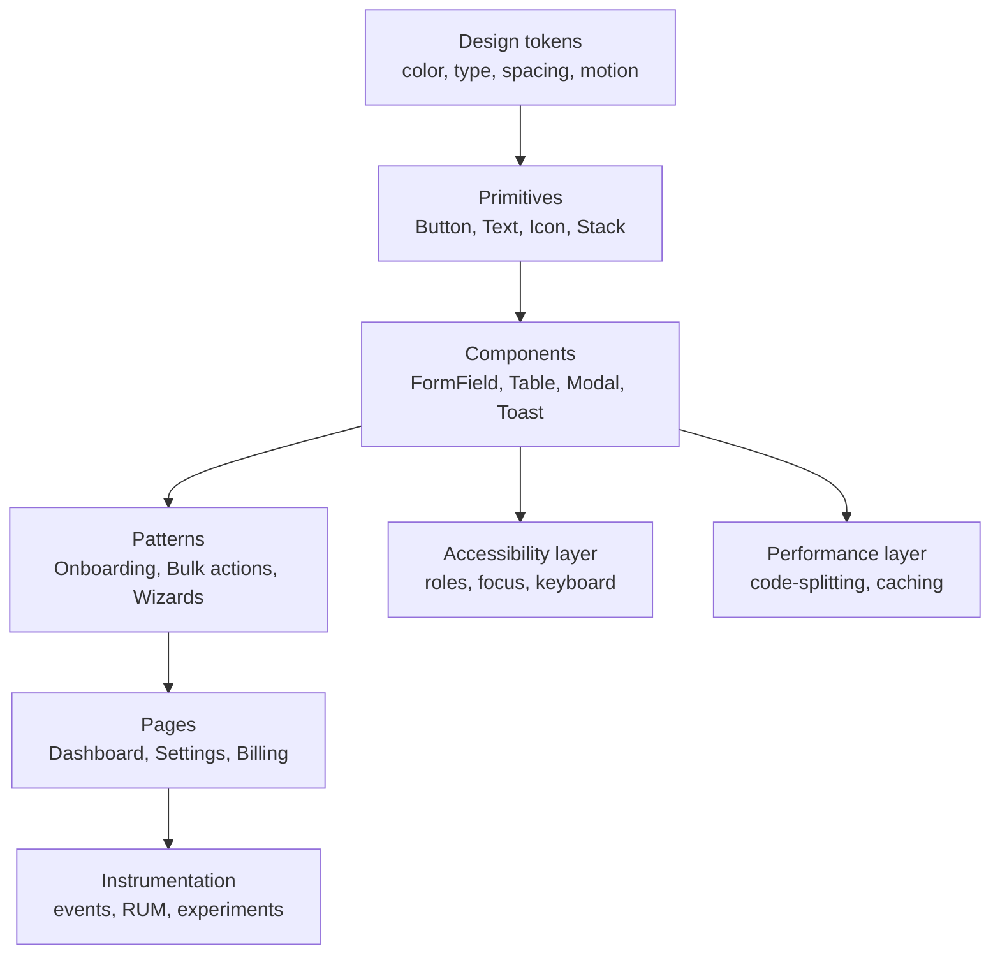
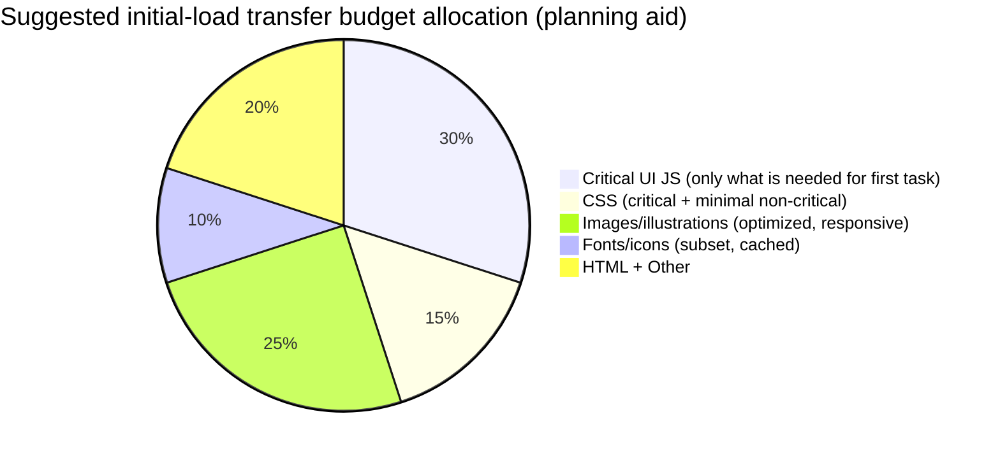

# Modern GUI Approaches for a Lean, Fast, Effective, Low-Confusion SaaS Web App

## Executive summary

A “leanest, fastest, most effective, least confusing” SaaS GUI is not primarily an aesthetic target; it is an execution model: design the UI around a small set of repeatable user goals, make the “next right action” obvious at each step, and treat performance + accessibility + error recovery as first-class product requirements with budgets enforced in CI. Industry standards and primary guidance converge on a few non-negotiables: (a) consistently visible system status and predictable behavior reduce confusion (a core usability heuristic), (b) progressive disclosure prevents overload by shielding advanced configuration until it becomes relevant, and (c) instrumentation and experimentation must be part of the UI delivery pipeline because “promising ideas” often do not move metrics in real products. citeturn19search1turn17search5turn27view0

The most actionable “modern approach” is to treat the SaaS interface as a set of composable, accessible primitives (navigation, forms, tables, dialogs, notifications) implemented once in a design system and reused everywhere via design tokens. Material’s token model (reference/system/component tokens) and the cross-vendor Design Tokens Format specification (exchange format for tokens) support this “build once, scale everywhere” principle and reduce accidental inconsistency—the root cause of many “confusing UI” moments. citeturn1search0turn3search0turn3search16

Performance should be defined using user-centered, field-measured targets: Core Web Vitals classify “good” user experience at the 75th percentile as LCP ≤ 2.5s, INP ≤ 200ms, and CLS ≤ 0.1. These thresholds—and the emphasis on the 75th percentile—are both a UI design constraint (what you can ship without degrading experience) and an engineering contract (what CI must prevent from regressing). citeturn20view0turn6search2

Accessibility should target WCAG 2.2 AA as the baseline because WCAG 2.2 is the current W3C Recommendation (published 5 Oct 2023) and adds success criteria that directly impact modern SaaS patterns—keyboard focus visibility under sticky UI (2.4.11), minimum target size (2.5.8), consistent help placement (3.2.6), reduced redundant entry in multi-step flows (3.3.7), and accessible authentication (3.3.8). citeturn0search12turn0search0turn25search1turn25search0turn25search2turn25search3turn2search3

Experimentation and measurement are required for “flawless” outcomes because real product changes frequently fail to improve the metrics they were intended to move. In a large-scale review of online controlled experiments, authors report that at Google/LinkedIn/Microsoft “about two-thirds of experiments” failed to improve target metrics, with failure rates even higher (80–90%) in well-optimized domains like search engines—evidence that “intuition-first UI changes” are unreliable without A/B validation. citeturn27view0

**Definition of DONE (verifiable artifacts).** This report defines “DONE” as a state you can independently verify via concrete artifacts: (1) a documented IA + journey map; (2) a versioned component library with tokens; (3) CI gates that enforce performance + accessibility budgets; (4) analytics event schema + experiment framework integration; (5) test coverage including visual regression, keyboard-only flows, and error handling; and (6) baseline metric dashboards showing CWV field performance and task success/time-on-task trends. (The standards and tooling that make these artifacts auditable are cited throughout: WCAG/WAI, web.dev, Lighthouse CI, WCAG-EM, etc.) citeturn0search12turn6search13turn6search5turn15search3turn6search2

## Comparative landscape and foundational principles

The table below highlights 12 highly-relevant “exemplars” for modern SaaS GUI work. These are not endorsements of specific visual styles; they are rich, audited pattern libraries and standards that reduce design ambiguity and implementation risk.

| Exemplar (product/system/pattern source) | What to emulate for a lean, user-friendly SaaS GUI | What to avoid (failure modes implied by the docs) |
|---|---|---|
| Material Design (M3) foundations + tokens | Use token-driven theming (avoid hardcoded values) and maintain a clear typographic hierarchy; treat color contrast as a usability primitive, not branding decoration. citeturn1search0turn1search20turn10search0 | Token sprawl without governance (tokens exist to encode decisions); avoid allowing “semantic drift” where the same role looks different across pages. citeturn1search0 |
| Shopify Polaris (content + errors + framework approach) | Treat microcopy as product UX: error messages should be specific, plain-language, and action-oriented; avoid jargon like “invalid.” Use a UI toolkit that is explicitly built for consistency across surfaces. citeturn7search3turn7search7 | Repetition and duplicated navigation/content is explicitly discouraged; avoid redundant UI chrome that re-states the same thing in multiple places. citeturn1search1turn7search3 |
| Atlassian Design System (navigation + content + icons + onboarding components) | Navigation systems should support progressive disclosure for deeper pages and help users find frequent items; iconography should aim for universal understanding; content design is treated as a foundation, not “nice-to-have.” citeturn1search3turn1search11turn10search3turn9search5 | Avoid navigation patterns that bury primary tasks; avoid icon metaphors that depend on local culture/language (explicitly warned). citeturn10search3turn1search11 |
| Microsoft Fluent 2 accessibility + inclusive design framing | Bake accessibility into design intent (“solve for one, extend to many”), and treat it as a design constraint throughout the system. citeturn1search2turn1search10 | Avoid treating accessibility as a late QA checklist; the guidance emphasizes embedding it in design and build workflows. citeturn1search2turn1search10 |
| IBM Carbon (tables, notifications, dashboards, loading patterns) | Use well-defined variants for dense SaaS staples: data tables (selection/expansion), notification taxonomy (inline/toast/modal), and dashboard patterns (exploration dashboards with search/sort/filter/drill-down). citeturn16search3turn23search3turn24search3 | Avoid cramped containers for dense tables and mixing inconsistent row heights; Carbon explicitly warns against these presentation pitfalls. citeturn16search3 |
| GitHub Primer (accessibility focus + governance) | Treat accessibility as an explicit part of the design system (policies, workflows, and documentation); recognize that components alone don’t prevent all a11y gaps—annotations and cross-discipline review matter. citeturn3search5turn3search9turn3search1 | Avoid assuming “using a design system” is sufficient for accessibility; Primer’s own a11y annotation work exists because gaps persist without additional guidance. citeturn3search9 |
| AWS Cloudscape (layout + service navigation + accessibility-first system) | Use structured app layout primitives (dashboard/form/table/cards/wizard page types) and explicit service navigation patterns grounded in IA + user mental models; ship responsive + accessible components by default. citeturn24search0turn17search2turn16search13turn16search1 | Avoid using top navigation for structural navigation when the pattern calls for side navigation; Cloudscape guidance explicitly positions side nav as structural IA support. citeturn17search2turn17search14 |
| Salesforce Lightning Design System (enterprise consistency + accessibility alignment) | For enterprise SaaS, use a unified language of patterns/components aimed at consistent UI at scale; align custom components with accessibility guidance and WCAG-level expectations. citeturn16search10turn3search3turn3search15 | Avoid reinventing base components without inheriting built-in accessibility and styling hooks; Salesforce recommends leveraging base components and SLDS blueprints when possible. citeturn3search15turn16search6 |
| Adobe Spectrum / Spectrum 2 | Treat accessibility as a starting point for system-wide UI modernization (contrast, keyboard, focus states, tags); provide multi-implementation support (CSS/React/web components) to reduce fragmentation. citeturn16search0turn16search8turn16search4 | Avoid accessibility as a “theme layer”; Spectrum 2 frames WCAG alignment and execution details (focus, keyboard) as foundational. citeturn16search8turn16search4 |
| W3C WAI-ARIA Authoring Practices (APG) for widgets | Use APG patterns for modal dialogs, tooltips, alerts, and interactive grids to ensure correct roles, keyboard behavior, and focus management—critical for SaaS dashboards and dense UIs. citeturn2search0turn2search2turn23search1turn2search1 | Avoid “DIY ARIA”; APG explicitly warns “No ARIA is better than Bad ARIA,” meaning incorrect semantics can harm accessibility worse than semantic HTML. citeturn23search1turn2search14 |
| web.dev + Chrome DevTools/Lighthouse guidance | Base decisions on critical rendering path mechanics (render-blocking CSS/JS), rendering tradeoffs (CSR/SSR/hydration), and measurable budgets; automate enforcement with Lighthouse CI. citeturn0search2turn4search1turn0search6turn6search13turn6search5 | Avoid “performance by hope”: without budgets, regressions ship; Lighthouse CI explicitly supports failing builds on budget violations. citeturn6search13turn6search5 |
| GOV.UK content design guidance | Use audience-first writing: clear, concise, structured content with an explicit focus on how people read; this is directly transferable to SaaS microcopy, onboarding, and help content. citeturn9search0 | Avoid jargon and overly complex language; these are recurring anti-patterns in enterprise SaaS UI copy and directly increase confusion. citeturn9search0 |

**Synthesis: the lowest-confusion SaaS GUIs operationalize a small set of heuristics.** The Nielsen Norman Group’s heuristic set highlights patterns that map cleanly to SaaS realities: keep system status visible (loading, saving, background jobs), use user language, minimize memory load (recognition rather than recall), make “exits” obvious (cancel/undo), and provide task-focused help that is easy to search. citeturn18search0turn18search2turn19search7turn19search0

## User journeys, information architecture, onboarding, and content

**What is missing (and why it matters).** Your prompt explicitly leaves target users and core tasks “unspecified.” Without them, it is not possible to truthfully select the correct information architecture, primary navigation, and default dashboard content for *your* SaaS. The rigorous answer is therefore: define users and tasks first, then design the IA and UI around them. This report provides a verified method and reusable templates, not claims about your specific product’s users.

**A rigorous, low-waste way to define target users and core tasks.** Use a small set of “task archetypes” that almost every SaaS has, then validate with interviews + instrumentation. The ISO framing of usability—effectiveness, efficiency, satisfaction in a specified context of use—implies that “context + goals” are first-order inputs to design, not optional details. citeturn21search16turn21search17
A practical mapping step is to define: (a) the user’s job-to-be-done, (b) the top 3–5 tasks with measurable outcomes, and (c) the constraints (device, environment, knowledge level, accessibility needs).

**Reusable SaaS journey template (to be customized with your actual tasks).** Below is a generic journey that is intentionally “comprehensive” (covers acquisition → activation → retention loops) but designed for progressive disclosure: each stage has one primary objective, and advanced concerns appear only when relevant.

**Information architecture and navigation patterns that minimize confusion.** Modern SaaS UIs typically converge on a “structural side navigation + context utilities” model because it scales to many pages without forcing users to memorize deep hierarchies:

- Material’s navigation guidance emphasizes structuring navigation around content and tasks, focusing attention on important destinations and de-emphasizing inessential ones. citeturn17search3
- Cloudscape’s service navigation pattern explicitly recommends organizing side navigation based on the service’s IA, primary use cases, and the user’s mental model; it also distinguishes when you need additional utility navigation like search/notifications/settings. citeturn17search2turn17search14
- Atlassian’s platform navigation guidance explicitly references progressive disclosure for deeper pages as a navigational strategy. citeturn1search3

**Practical navigation defaults (pattern-level, stack-agnostic).**
A low-confusion baseline that aligns with the sources above: keep global navigation stable; use a side nav for structural destinations; reserve top nav for global utilities (search, help, profile, notifications); use breadcrumbs when the IA is hierarchical; and provide “recents/starred” where task switching is frequent (Atlassian’s research for navigation improvements highlights better access to frequent items via “Starred” and “Recent”). citeturn1search11turn17search2turn17search3

**Onboarding and progressive disclosure.** Progressive disclosure is repeatedly recommended in modern SaaS navigation and onboarding because it reduces overload: Atlassian directly suggests progressive disclosure for deeper pages, and WCAG 2.2 adds criteria that effectively push products toward less repetitive, more navigable flows (e.g., “Redundant Entry”). citeturn1search3turn25search3turn0search0
A rigorous approach is to treat onboarding as an experiment with a measurable “first success” event and to instrument drop-off points. The need for this rigor is reinforced by experimentation literature: in scaled A/B testing practice, many “promising” product ideas fail to improve intended metrics. citeturn27view0

**Microcopy and UX writing rules that reduce confusion.** A cross-source consensus emerges:

- Use plain language and structure content for how people read (GOV.UK writing guidance). citeturn9search0
- Keep error messages short, specific, and actionable; avoid jargon like “invalid” (Polaris error guidance). citeturn7search3
- Use interaction verbs that work across input methods (“select” instead of “click/swipe”), improving clarity across desktop and mobile contexts (Microsoft Style Guide). citeturn9search2turn9search6
- Treat inclusive language and localizability as foundational content concerns (Atlassian content guidance). citeturn9search5

**Sample UI patterns and microcopy examples (onboarding, empty states, errors, confirmations).** These examples intentionally follow the cited rules: plain language, cross-input verbs, specific instructions, and minimal blame.

| Pattern | UI behavior | Microcopy examples (ready to adapt) | Why this reduces confusion |
|---|---|---|---|
| Onboarding goal choice (step 1) | Single question, 3–5 goal options; “Skip for now” available; saves choice immediately | Title: “What are you here to do first?” Options: “Track projects,” “Import data,” “Invite my team,” “Explore a demo workspace.” Secondary: “Skip for now.” | Goal-first onboarding supports progressive disclosure: users see only the path relevant to their intent (recommended approach in modern onboarding and supported by progressive disclosure usage). citeturn1search3turn25search3 |
| Onboarding checklist (lightweight) | Checklist in a side panel; each item deep-links to the step; shows completion state | “Set up your workspace” (0/3). Items: “Add your first project,” “Invite a teammate,” “Connect your data source.” | Checklists externalize memory—aligned with “recognition rather than recall.” citeturn18search2turn19search4 |
| Empty state (new user) | Explains why it’s empty + offers primary CTA; optional secondary link to documentation | “No projects yet.” Body: “Create a project to start tracking work and deadlines.” Primary: “Create project.” Secondary: “Learn how projects work.” | Empty states should orient users when content is missing and help them start the workflow (explicit component guidance exists in practice-oriented design systems). citeturn8search0 |
| Inline form error | Inline error near field + summary at top if multiple errors; preserves entered data | Field: “Email” → “Enter an email address in the format name@company.com.” Top summary: “Check the highlighted fields.” | Aligns with WCAG Error Identification + Error Suggestion (identify error, provide correction guidance). citeturn11search0turn11search1turn7search3 |
| Destructive confirmation (modal) | Confirm intent; states consequence; offers safe exit; keyboard focus managed | Title: “Delete API key?” Body: “Apps using this key will stop working.” Primary (destructive): “Delete key.” Secondary: “Cancel.” | Explicit “exits” and clear consequences support user control and reduce costly mistakes. citeturn19search7turn2search0 |
| Background save feedback | Non-blocking status near edited field + global “Saved” indicator; includes failure fallback | Success: “Saved.” Failure: “Couldn’t save. Check your connection and try again.” Action: “Retry.” | “Visibility of system status” is a primary usability heuristic; optimistic UI must have rollback and retry. citeturn19search1turn11search3turn11search2 |

## Component architecture and interaction patterns

**Visual hierarchy as a functional system, not decoration.** The “least confusing” interfaces treat hierarchy as an information system: typography defines scanning structure; spacing defines grouping; color encodes state/priority (not just brand); iconography reduces ambiguity only when symbols are universally understood.

- Material typography guidance is explicitly framed around hierarchy and readable text structure. citeturn1search20
- Material’s accessibility guidance for color contrast frames contrast as enabling interpretation and interaction and emphasizes supporting users with low vision. citeturn10search0
- WCAG contrast guidance requires sufficient contrast for text (SC 1.4.3) and UI components/meaningful graphics (SC 1.4.11) to ensure distinguishability. citeturn10search1turn10search2
- Atlassian iconography principles explicitly prioritize “universal understanding” and warn against culture/language-specific metaphors. citeturn10search3

**Component relationship model (how to prevent inconsistency).** The most robust modern approach is: tokens → primitives → composed components → pages. Tokens encode decisions; components should consume tokens, not raw values; pages should assemble components without re-implementing behaviors like focus management or error handling.

**Component design guidance (forms, tables, dashboards, modals, notifications, tooltips).** The checklist below focuses on behaviors that directly reduce confusion and operational risk.

| Component | Must-have behavior for “result-oriented” SaaS | Accessibility (WCAG/WAI) essentials | Common failure mode to preempt |
|---|---|---|---|
| Forms (field + group) | Clear labels; inline validation that doesn’t overload; preserves entered data; supports undo for destructive changes | Use programmatic labels (WAI forms tutorial; HTML `<label>` association); ensure errors are identified and described; provide suggestions when possible. citeturn22search6turn22search2turn11search0turn11search1 | “Validation spam” (multiple conflicting error indicators) and wiping user input after submit errors (increases abandonment). Polaris warns against overload and emphasizes actionable specificity. citeturn7search3turn7search1 |
| Authentication forms | Support password managers and autofill; avoid blocking paste; offer passkeys where applicable | WCAG 2.2 SC 3.3.8 requires accessible authentication; guidance notes proper markup supports autofill and must not be blocked. citeturn2search3turn22search3 | CAPTCHA or “memory tests” as hard gates; blocking autofill scripts (explicitly called out as failing SC 3.3.8). citeturn2search3 |
| Tables / data grids | Sort/filter/pagination controls adjacent to the table; bulk actions; saved views; column management | For interactive tabular data, consider ARIA grid pattern to support efficient keyboard navigation and shorter tab sequences. citeturn24search2turn2search1turn2search16 | Dense tables inside cramped containers; Carbon explicitly warns against nested tables and cramped placement. citeturn16search3 |
| Dashboards | Use task-driven widgets; support drill-down; provide empty/loading states per panel | Carbon describes exploration dashboards as interactive surfaces (search/sort/filter/drill down). citeturn24search3 | “Wall of charts” without clear next actions; missing states that leave users uncertain what changed or what to do next. |
| Modals / dialogs | Use only for interruptions or focused tasks; keep actions minimal; show consequences | Use WAI-ARIA dialog (modal) pattern: manage focus, use correct roles, ensure escape routes and focus trap. citeturn2search0turn2search12turn19search7 | Modal stacks and unclear exits; keyboard users losing focus behind overlays (common with poorly implemented dialogs). citeturn2search0turn25search1 |
| Notifications (toast/inline/banner) | Show status without derailing task flow; provide action when needed (retry/undo); unify taxonomy | Carbon defines variants (inline/toast/actionable/modal) and gives usage + placement guidance; WAI APG alert pattern covers announcements of important messages. citeturn23search3turn23search18turn23search1 | Overusing high-urgency styles; toast spam; unreadable multi-line volume. Carbon notes limiting toast text (two lines) and describes stacking/behavior. citeturn23search14 |
| Tooltips | Use for brief clarification; don’t hide critical instructions; make dismissible via focus/blur behavior | APG tooltip pattern: tooltip has `role="tooltip"` and trigger references with `aria-describedby`; dismissal rules differ for hover vs focus. citeturn2search2 | Tooltips used as primary help (bad for mobile/keyboard); missing keyboard behavior or inaccessible descriptions. citeturn2search2 |

**State management and optimistic UI (to feel fast without lying).** “Modern” SaaS interfaces increasingly use optimistic updates—showing the expected result immediately—because it improves perceived responsiveness. However, both Apollo and TanStack explicitly emphasize failure handling: optimistic updates must support rollback/refetch when the mutation fails. citeturn11search2turn11search3
A rigorous pattern is: optimistic update → show “Saving…” state → confirm “Saved” on server acknowledgment → if failure, revert and show a retryable error with preserved user intent.

## Performance, security, privacy, and internationalization

**Performance: designing for speed at the GUI level.** Performance is a UI feature. The critical rendering path explains why: render-blocking CSS and JavaScript in the document head can delay first render; browsers parse HTML streaming, but they must wait for render-blocking resources to complete before finishing initial render. citeturn0search2turn0search10
Lighthouse guidance similarly frames render-blocking resources as a primary opportunity: reduce impact by inlining critical resources, deferring non-critical resources, and removing unused code. citeturn0search6

**Rendering strategy: CSR vs SSR vs hybrid.** web.dev’s rendering overview describes the tradeoffs: server-side rendering can produce HTML on demand but can be slower than serving static rendered content; hydration reduces tradeoffs but too much client work after SSR can still increase Total Blocking Time and worsen responsiveness metrics like INP. citeturn4search1
Given the goal “leanest and fastest,” the modern pattern is “server/edge for first paint, client for interactivity,” minimizing on-load JS and deferring non-critical UI.

**Code splitting and loading only what’s needed.** Code splitting is a first-class technique in major ecosystems: React docs describe code splitting as a way to “lazy-load” only what’s needed, dramatically improving performance; webpack documentation frames code splitting as splitting into bundles loaded on demand or in parallel with major impact on load time. citeturn4search4turn4search16
Even if you do not use React/webpack, the underlying approach is stack-agnostic: route-level splitting, component-level splitting for rarely used UI (e.g., admin-only modals), and prioritized loading of above-the-fold UI.

**Caching: browser + CDN/edge.** The HTTP `Cache-Control` header controls caching in browsers and shared caches (including CDNs). citeturn4search2
Edge caching is vendor-specific in mechanics but conceptually consistent: Cloudflare describes serving content faster by storing copies in globally distributed data centers, and its cache rules allow overriding origin cache headers for edge TTL behavior. citeturn4search15turn4search3
For SaaS apps, the “least confusing” caching strategy avoids stale/incorrect UI by carefully separating cacheable static assets (JS/CSS/fonts) from user-specific dynamic data (API responses with appropriate validation and privacy protections).

**Performance budget pie (recommended allocation concept).** This is a *planning visualization* (not a universal truth). The point is to force explicit tradeoffs: if interactivity and clarity matter, you cannot allocate most of your initial-load budget to non-essential JS or unoptimized media.

**Security and privacy UX: reduce risk without adding confusion.**
Modern SaaS security UX must satisfy both usability and standards:

- Accessible authentication: WCAG 2.2 SC 3.3.8 (Accessible Authentication) explicitly notes that well-marked-up login fields can allow user agents to recognize and autofill credentials, and blocking filling (e.g., via script) can fail the criterion. citeturn2search3turn22search3
- Authentication policy: NIST SP 800-63B-4 (final, July 2025) defines technical requirements for authentication and authenticator management (primarily for U.S. government systems but widely used as a reference). citeturn13view0
- Reauthentication and MFA: OWASP’s Authentication Cheat Sheet recommends context-aware reauthentication for suspicious activity, account recovery, and critical actions, emphasizing security without unnecessary disruption. citeturn12search1
- Passkeys / WebAuthn: the WebAuthn Level 2 spec defines an API for strong public key credentials for web apps, enabling cryptographic authentication beyond passwords. citeturn12search10turn12search2
- Privacy clarity: GDPR Article 12 requires information to be provided in a concise, transparent, intelligible, easily accessible form using clear and plain language (especially for children), which directly impacts consent dialogs, privacy notices, and data export UX. citeturn12search3turn12search7

**Internationalization/localization: build global-readiness into the UI layer.** W3C’s internationalization guidance emphasizes that internationalization (i18n) significantly affects how easy localization is, and retrofitting global readiness is much harder than designing for it upfront. citeturn14search2turn14search0
From a data/UI standpoint, Unicode CLDR provides locale data patterns (dates, numbers, currencies, units) and is widely referenced for formatting and parsing. citeturn14search1turn14search17
Accessibility intersects i18n: WCAG SC 3.1.1 requires the default human language of each page to be programmatically determinable (e.g., `lang`), enabling assistive technologies to use correct language rules. citeturn14search3

## Measurement, experimentation, testing, budgets, and roadmap

**Metrics to measure success (and keep the GUI “result-oriented”).** A rigorous measurement model combines: product metrics (conversion/activation/retention), usability metrics (task success/time-on-task/error rate), and experience health metrics (Core Web Vitals + accessibility conformance).

- Usability definition grounding: NIST’s glossary cites ISO 9241-11:2018, defining usability as achieving specified goals with effectiveness, efficiency, and satisfaction in a specified context of use. citeturn21search16
- NIST’s usability testing guidance operationalizes this into measurable concepts: effectiveness (completion rate; number of errors) and efficiency (resources expended, generally measured as task time). citeturn21search17
- Experience health: Core Web Vitals thresholds and the 75th percentile framing provide a standard, field-focused way to define “fast enough.” citeturn20view0turn6search2
- UX at scale: Google’s HEART framework was designed to map product goals to user-centered metrics (Happiness, Engagement, Adoption, Retention, Task success). citeturn21search3

**Analytics and A/B testing strategy (how to avoid shipping “confusing improvements”).**
A modern SaaS UI strategy treats experimentation as a safety system:

- Controlled experiments are used by major tech companies to make data-driven product decisions; the scale has grown dramatically as marginal costs approach zero. citeturn27view0
- “Test everything” is a rational response to the reality that many shipped ideas fail to improve the metrics they were designed to change; this is explicitly reported in the experimentation literature cited earlier. citeturn27view0

**Minimum rigor requirements for trustworthy UI experiments (stack-agnostic deliverables).**
Define for every experiment: hypothesis, primary metric, guardrail metrics (e.g., error rate, support tickets), segmentation (new vs returning users), and rollback criteria. For performance-related UI changes, incorporate field measurement (RUM): web.dev explicitly distinguishes field data (RUM), which is what Google uses for CWV threshold assessment, and recommends collecting both lab and field data for a well-rounded analysis. citeturn6search2

**Testing and QA: shifting quality left with verifiable gates.**

- Performance regression prevention: web.dev recommends Lighthouse CI for performance monitoring and notes you can fail builds based on pre-defined criteria and budgets via configuration. citeturn6search13turn6search5
- Performance budgets as a concept: web.dev defines a performance budget as limits on metrics that affect performance (page size, load time, request count), used to drive decisions and prevent regressions. citeturn6search0
- Accessibility evaluation methodology: W3C’s WCAG-EM provides a step-by-step evaluation methodology; the in-progress WCAG-EM 2 draft expands applicability beyond websites to apps and other digital products. citeturn15search3turn15search7
- Automated accessibility testing: axe-core is a widely used automated accessibility engine; Deque documents that the axe API runs in modern browsers and integrates with existing test infrastructure. citeturn15search6turn15search14
- Visual regression testing: Storybook supports visual testing (via Chromatic) where stories become visual tests, and Playwright supports screenshot comparisons with snapshot update workflows—both enabling systematic detection of unintended UI changes. citeturn15search0turn15search1turn15search4

**Recommended performance and accessibility budgets and CI checks (starting baseline).** These are framed as *budgets to enforce*, grounded in standards where possible.

| Category | Budget / gate | Rationale + primary source |
|---|---|---|
| Core Web Vitals (field, 75th percentile) | LCP ≤ 2.5s, INP ≤ 200ms, CLS ≤ 0.1, measured at p75 | web.dev defines CWV thresholds and explicitly uses the 75th percentile for classification. citeturn20view0turn6search2 |
| Rendering path | No unintentional render-blocking CSS/JS for initial route; critical CSS prioritized | Critical rendering path depends on render-blocking resources; Lighthouse flags render-blocking resources and recommends deferring/removing unused. citeturn0search2turn0search6 |
| Caching correctness | Static assets cacheable with explicit `Cache-Control`; user data not cached publicly | `Cache-Control` governs caching in browsers and shared caches (including CDNs). citeturn4search2 |
| Accessibility conformance target | WCAG 2.2 AA as default target; document exceptions | WCAG 2.2 is a W3C Recommendation; conformance to 2.2 implies conformance to 2.1/2.0. citeturn0search12turn0search0 |
| Keyboard focus visibility | Must satisfy WCAG 2.4.11 Focus Not Obscured (Minimum) across sticky headers/sidebars/modals | New WCAG 2.2 criterion targets modern sticky UI patterns. citeturn25search1turn0search0 |
| Touch target sizing | Meet WCAG 2.5.8 Target Size (Minimum) for interactive targets or spacing | WCAG 2.2 criterion explicitly addresses activation difficulty with small/close targets. citeturn25search0turn0search0 |
| Accessible authentication UX | Must satisfy WCAG 3.3.8; do not block autofill/password managers | W3C understanding notes autofill recognition and disallows blocking mechanisms. citeturn2search3turn22search3 |
| Error handling | WCAG 3.3.1 + 3.3.3: identify errors and provide suggestions where possible | W3C understanding docs define goals and intent for these criteria. citeturn11search0turn11search1 |
| CI tooling gates | Lighthouse CI assertions fail builds on regression; axe-core (or equivalent) fails on new serious violations; visual regression diffs reviewed | Lighthouse CI supports budgets + build failure; axe-core integrates in test infra; Storybook/Chromatic and Playwright support visual diffs. citeturn6search13turn15search14turn15search0turn15search1 |

**Component-level implementation checklist (engineering deliverable).** This checklist is intended to be copy-pasted into your engineering acceptance criteria. “DONE” means each item is implemented, documented, and tested.

| Area | Checklist items (minimum) | Verification artifact |
|---|---|---|
| Navigation + IA | Side nav supports structural IA; global search placement consistent; breadcrumbs for deep hierarchies; recents/starred if task switching is frequent | IA spec + navigation component docs; usability test tasks covering navigation success citeturn17search2turn1search11 |
| Forms | Every control has programmatic label; errors identified + suggested fixes; values preserved on failure; supports autofill where relevant | Accessibility test results + form component doc referencing label association citeturn22search6turn11search0turn11search1 |
| Tables | Sorting/filter/pagination near table; batch actions; density controls; keyboard navigation strategy documented (table vs grid) | Table component docs + keyboard interaction tests citeturn24search2turn2search1turn16search3 |
| Dialogs + overlays | Focus managed; escape/cancel available; confirms consequences for destructive actions | APG-based dialog behavior tests citeturn2search0turn19search7 |
| Notifications | Variant taxonomy defined; toasts limited and non-invasive; retry/undo where appropriate; ARIA announcements for important alerts | Notification component docs + screen reader smoke tests citeturn23search3turn23search1turn23search4 |
| State + optimistic UI | Optimistic updates have rollback; retry path consistent; “saving/saved” status visible | State management doc + integration tests simulating failures citeturn11search2turn11search3turn19search1 |
| Performance | Critical-path assets minimized; code-splitting strategy documented; rendering strategy selected with tradeoffs | Performance budget config + Lighthouse CI reports citeturn6search0turn4search1turn6search13 |
| i18n/l10n | Locale formatting uses CLDR-backed libraries; `lang` set; RTL and long-text tested | Localization QA checklist + WCAG language verification citeturn14search1turn14search3turn14search2 |
| Security + privacy UX | Passkeys/WebAuthn considered; reauth for critical actions; privacy notices plain language | Security UX spec + legal/privacy copy review citeturn12search10turn12search1turn12search3 |

**Prioritized roadmap (MVP → v1 → v2) with effort levels and deliverables.** Effort is relative (low/medium/high) because actual effort depends on scope, team size, and existing infrastructure.

| Phase | Priority focus | Key deliverables (verifiable artifacts) | Effort |
|---|---|---|---|
| MVP | One core journey end-to-end, minimal but consistent UI system | IA + journey map; navigation shell; core form + table components; error/empty/loading states; initial performance + a11y budgets in CI | High |
| v1 | Scale to multiple workflows without UI drift | Tokenized design system; expanded component set (modals/notifications/tooltips); onboarding checklist; analytics schema + first experiments; accessibility conformance evaluation method defined | High |
| v2 | Advanced efficiency + polish without confusion | Saved views, bulk actions, keyboard shortcuts; optimistic UI where safe; localization expansion; hardened privacy/security UX (reauth, passkeys); visual regression suite; continuous monitoring dashboards | Medium–High |

**Why this roadmap is “lean.”** MVP is intentionally constrained to the minimum component set that supports real SaaS work (navigation + forms + tables + feedback states). v1 and v2 primarily “scale consistency,” not page count—because inconsistency is a major driver of confusion, and design tokens + design system governance are the scalable fix. citeturn1search0turn3search0turn6search0
