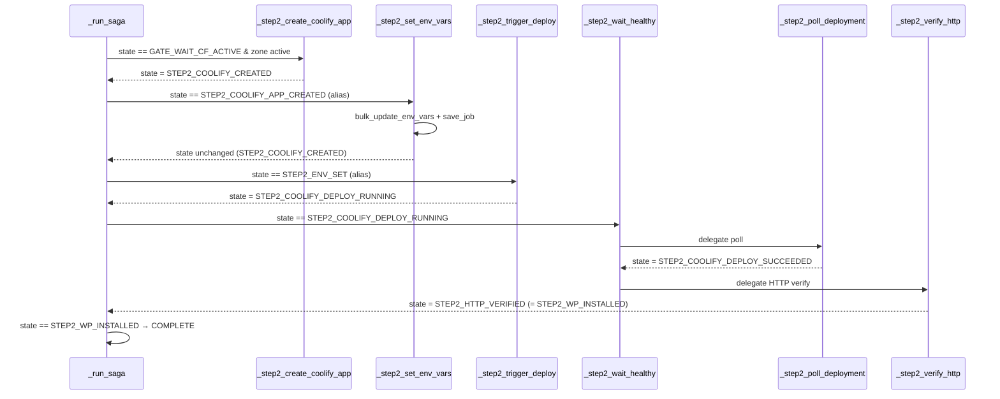

# Site Provisioner Reference (legacy)

**Last Updated:** 2026-04-22 (verified against `src/fabrik/provisioner.py`)

> **⚠️ Legacy module — Coolify era.** `src/fabrik/provisioner.py` is the
> pre-migration provisioner that called the Coolify API to create
> Application and Service entries. Post-migration (2026-05) the active
> deploy path is `orchestrator/deployer_ssh.py` (SSH + Docker Compose).
> The module is retained for legacy CLI commands (`fabrik status`,
> `fabrik logs`, `fabrik reconcile-all`) that still talk to the Coolify
> API for services that were never migrated; do not plan new work
> against this module.

The Site Provisioner orchestrates Steps 0-1-2 for **brand-new WordPress site bootstrap** (domain registration → DNS + CF zone → Coolify app + WP install) using a saga pattern with granular states for safe retries and partial failure recovery.

**Scope:** this module handles **new-site setup only**. Routine WordPress deploys now go through the standalone `wpf` CLI (moved to /opt/wpf/). For generic service deploys, see `src/fabrik/orchestrator/` (`DeploymentOrchestrator`).

## Overview

```
INIT → STEP0_CF_ZONE_CREATED → STEP0_DOMAIN_REGISTERED →
STEP1_DNS_RECORDS_UPSERTED → STEP1_CF_STATUS_SNAPSHOT →
GATE_WAIT_CF_ACTIVE → STEP2_COOLIFY_APP_CREATED →
STEP2_ENV_SET → STEP2_DEPLOY_TRIGGERED → STEP2_WP_INSTALLED → COMPLETE
```

## Source

- **Module:** `src/fabrik/provisioner.py`
- **Dependencies:** `CoolifyClient`, `ComposeLinter`, Jinja2

## Environment Variables

| Variable | Default | Description |
|----------|---------|-------------|
| `DNS_MANAGER_URL` | `https://dns.vps1.ocoron.com` | DNS Manager API endpoint |
| `VPS_IP` | `172.93.160.197` | Target VPS IP for DNS records |
| `COOLIFY_SERVER_UUID` | `jk4wskkcks8csg4gcokwgw8s` | Coolify server UUID |
| `COOLIFY_HEALTH_TIMEOUT` | `600` | Seconds to wait for deployment health |

## Usage

### Start New Provisioning Job

```python
from fabrik.provisioner import SiteProvisioner, SiteProvisionRequest, ContactInfo

contact = ContactInfo(
    FirstName="John",
    LastName="Doe",
    Address1="123 Main St",
    City="New York",
    StateProvince="NY",
    PostalCode="10001",
    Country="US",
    Phone="+1.5551234567",
    EmailAddress="john@example.com",
)

request = SiteProvisionRequest(
    domain="example.com",
    preset="company",
    contact=contact,
    years=1,
    whoisguard=True,
)

with SiteProvisioner() as provisioner:
    job = provisioner.start(request)
    # Poll job.state until COMPLETE or FAILED_*
```

### Resume Failed Job

```python
with SiteProvisioner() as provisioner:
    job = provisioner.load_job("example-com-abc123")
    provisioner.resume(job)
```

### Get Job Status

```python
from fabrik.provisioner import get_provision_status

status = get_provision_status("example-com-abc123")
print(status["state"])
```

## Saga Steps

### Step 0: Domain Registration

| Method | Description |
|--------|-------------|
| `_step0_create_cf_zone` | Create Cloudflare zone to obtain nameservers |
| `_step0_register_domain` | Register domain at Namecheap with CF nameservers |

### Step 1: DNS Setup

| Method | Description |
|--------|-------------|
| `_step1_upsert_dns_records` | Add A record (root) and CNAME (www) pointing to VPS |
| `_step1_snapshot_cf_status` | Snapshot Cloudflare zone status |

### Gate: CF Activation

| Method | Description |
|--------|-------------|
| `_gate_wait_cf_active` | Poll until Cloudflare zone becomes active (up to 1 hour) |

### Step 2: WordPress Deployment

| Method | Description |
|--------|-------------|
| `_step2_create_coolify_app` | Create Coolify project and docker-compose service |
| `_step2_set_env_vars` | Set runtime environment variables via `fabrik apply` (SSH + Docker Compose) |
| `_step2_trigger_deploy` | Explicitly trigger deployment |
| `_step2_wait_healthy` | Wait for deployment health and verify HTTP access |
| `_step2_poll_deployment` | Poll Coolify service status until running/healthy |
| `_step2_verify_http` | Verify WordPress is accessible via HTTPS |

## Environment Variables Set by `_step2_set_env_vars`

| Env Var | Source |
|---------|--------|
| `WORDPRESS_DB_PASSWORD` | `job.db_password` |
| `MYSQL_ROOT_PASSWORD` | `job.db_root_password` |
| `WORDPRESS_ADMIN_PASSWORD` | `job.wp_admin_password` |
| `WORDPRESS_SITE_URL` | `https://{job.domain}` |
| `SITE_NAME` | `job.site_name` |

## State Aliases

For backward compatibility, some states share the same string value:

| Alias | Actual Value |
|-------|--------------|
| `STEP2_COOLIFY_APP_CREATED` | `STEP2_COOLIFY_CREATED` |
| `STEP2_ENV_SET` | `STEP2_COOLIFY_CREATED` |
| `STEP2_DEPLOY_TRIGGERED` | `STEP2_COOLIFY_DEPLOY_REQUESTED` |
| `STEP2_WP_INSTALLED` | `STEP2_HTTP_VERIFIED` |

## Saga Flow Diagram



## Error Handling

- **Retryable failures:** Stored in `FAILED_RETRYABLE` state, can resume with `provisioner.resume(job)`
- **Terminal failures:** Stored in `FAILED_TERMINAL` state, require manual intervention
- **Job persistence:** Saved to `data/provision_jobs/{job_id}.json` after each state transition

## Related

- `@/opt/fabrik/docs/reference/drivers.md` - CoolifyClient API reference
- `@/opt/fabrik/docs/reference/orchestrator.md` - Higher-level orchestration
- `@/opt/fabrik/templates/wordpress/base/` - WordPress compose templates
