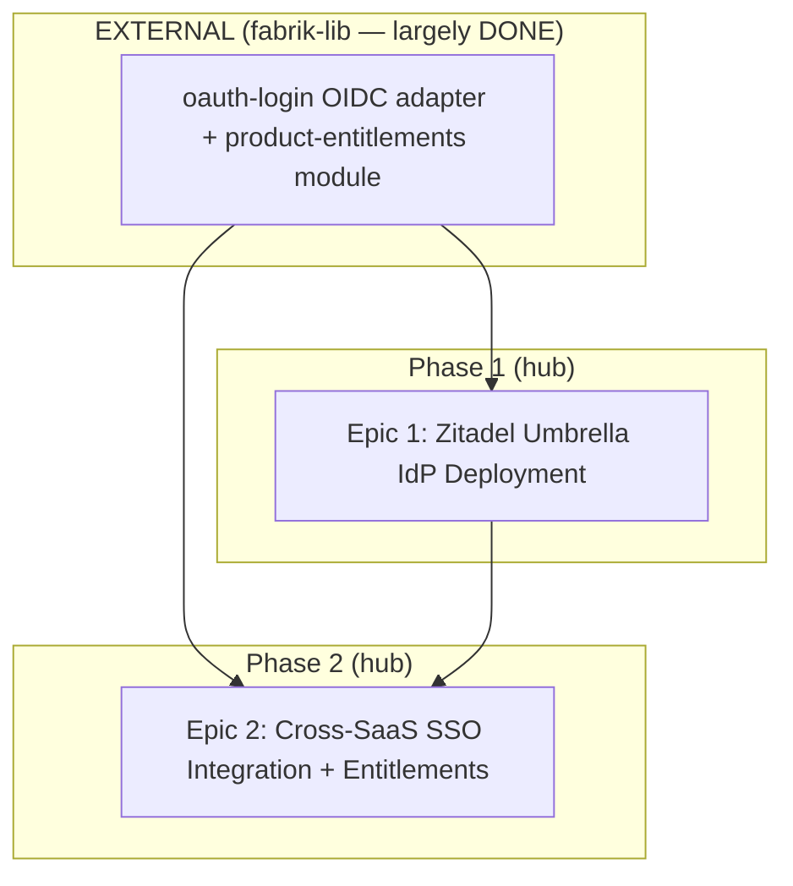

# Epic Proposal — Umbrella SSO + Cross-Product Entitlements

**Status:** PROPOSED 2026-08-27 · **Source vision:** docs/superpowers/specs/2026-08-27-umbrella-sso-vision.md (LOCKED)
**Mode:** EXISTING (fleet-level) · **Decomposition judgment:** single-agent Opus (fleet)
**Scale:** 2 HUB epics (sequential) + 1 EXTERNAL fabrik-lib prerequisite (out-of-scope per vision).

> Vision features 3 (`oauth-login` OIDC adapter) + 4 (`product-entitlements` module) are the vision's
> **Out of Scope** (fabrik-lib owns them, infra says largely DONE) → they do NOT become hub epics; they are
> the **external inherited prerequisite** both hub epics vendor. This is a cross-repo boundary, not a dropped
> feature.

## Epic list (compact — full expansion in /fab-mega-03-expand)

### Epic 1: Zitadel Umbrella IdP Deployment
- **Scope:** Deploy self-hosted **Zitadel v4** as the central OIDC provider at `auth.ocoron.com`; brand + i18n
  (en+tr) its hosted login UI; wire its SMTP to Resend. The identity foundation the whole suite federates to.
- **Features:** #1 (Umbrella IdP), #2 (IdP hosted login UI)
- **Scaffold:** none new — Zitadel is a deployed third-party `service` via a hand-authored
  `specs/services/zitadel.yaml` (Go binary + its own Postgres DB); no fabrik scaffold type.
- **Depends on:** none — root epic.
- **Parallel with:** sequential (Epic 2 depends on this — cannot run concurrently).
- **Port:** Traefik-routed on `auth.ocoron.com`; **no host `ports:`** (Fabrik 30-ops invariant); container
  listens on Zitadel's default `:8080` inside its own container namespace (no host collision — PORTS.md host
  ranges untouched).
- **Target host:** `vps1` (hub — Zitadel's DB lives on `postgres-main`).
- **Delivers:** a live umbrella login — the operator creates an account and signs in at
  `https://auth.ocoron.com`; the OIDC discovery doc + JWKS are live and reachable.
- **Consumes:** none — root epic.
- **Produces:** the OIDC issuer (`auth.ocoron.com`) + discovery/JWKS endpoints; a Zitadel project+app per RP
  with client-id/secret; the **Authorization v2** grant API surface; env `ZITADEL_ISSUER` + per-RP client creds.
- **Owned paths:** `specs/services/zitadel.yaml`, the Zitadel deploy dir (compose/config); **no RP code**.
- **Rule Packs:** core/30-ops, core/35-security-auth, core/55-observability, core/58-resilience.
- **HAS_USER_GUIDE:** false (infra service).
- **Shape:** `kind: service` · is_public: true · is_admin_dashboard: false · has_bearer_api: false ·
  has_persistent_data: true · needs_database: true · has_search_feature: false · needs_cache: false ·
  exposes_metrics: true · watchdog.enabled: **false** (not an LLM caller — explicit opt-out).
- **Concurrency:** none (managed third-party service).
- **i18n:** en+tr — via **Zitadel's own custom-branding/i18n** (not a fabrik scaffold → the `i18n-kit` vendor
  step is N/A; the mandate is met by Zitadel's native i18n).
- **Responsive:** yes — Zitadel Login v2 is responsive (third-party UI).
- **Dark+Light:** Zitadel branding supports both (best-effort; third-party UI, not the fabrik scaffold mandate).
- **Registrars:** postgres (needs_database) · gatus (is_public + domain) · prometheus (exposes_metrics +
  domain) · backrest (has_persistent_data) · grafana (always) · glitchtip (kind=service). NOT redis, NOT
  authelia (Zitadel *is* the auth), NOT meilisearch.
- **Universal categories:** 1, 2, 3, 8, 10, 11, 12, 13
- **Abuse Detection:** N/A — Zitadel owns its own registration hardening; not a fabrik-built free-tier signup.
- **Email:** transactional — Zitadel SMTP → Resend (verification/passwordless).
- **FINANCIALS:** N/A.

### Epic 2: Cross-SaaS SSO Integration + Entitlements
- **Scope:** Federate each relying-party SaaS to the umbrella (via the fabrik-lib `oauth-login` OIDC adapter)
  + a per-SaaS `LocalAuthBridge`; vendor `product-entitlements` for the source-checked grant gate; build the
  **idempotent billing→grant reconciler** (Authorization v2); wire **revocation→live-session teardown**
  (OIDC back-channel logout / short local TTL). Standalone login coexists.
- **Features:** #5 (per-SaaS LocalAuthBridge), #6 (billing→grant reconciler), #7 (revocation teardown),
  #8 (standalone coexistence)
- **Scaffold:** none new — code in **existing RP projects** (youtube, transdoc, web-ecommerce-factory, +
  future) + vendored fabrik-lib modules. ⚠️ **CROSS-REPO:** each RP integration lives in that product's own
  repo and dispatches to its agents; this hub epic **coordinates** + owns the shared reconciler/bridge pattern.
- **Depends on:** Epic 1 (needs a live issuer) **+ [EXTERNAL] fabrik-lib** features #3 (oauth-login OIDC
  adapter) + #4 (product-entitlements module).
- **Parallel with:** sequential (depends on Epic 1). *Per-RP tickets WITHIN this epic parallelize (03/05).*
- **Port:** none new — modifies existing services; each RP keeps its port.
- **Target host:** per-RP (inherited — each RP on its existing `target_vps`).
- **Delivers:** one umbrella login lands the user in **every entitled product**; revoking a grant blocks access
  within the cache TTL AND tears down live product sessions.
- **Consumes:** Epic 1's OIDC issuer + per-RP client creds + Authorization-v2 grant API; **[external]** the
  fabrik-lib `product-entitlements` module + `oauth-login` OIDC adapter.
- **Produces:** per-RP `LocalAuthBridge`; the idempotent billing→grant reconciler; the revocation teardown
  hook; `shape.needs_cache: true` on every consuming RP spec (the short-TTL grant cache).
- **Owned paths:** the shared reconciler/bridge pattern module + integration docs in the hub; **per-RP:**
  `<rp-repo>/src/**/auth_bridge`, `<rp-repo>/specs/services/<rp>.yaml` (needs_cache) — **owned by each RP's own
  repo/agents** (cross-repo). Hub-owned: the shared pattern + this epic's coordination docs only.
- **Rule Packs:** saas/95-multi-tenant-saas, core/35-security-auth, core/85-payments-billing,
  core/58-resilience, core/45-testing-strategy.
- **HAS_USER_GUIDE:** per-RP (inherited).
- **Shape:** modifies existing RP shapes — the load-bearing change is **`shape.needs_cache: true` on EVERY
  consuming RP** (HARD constraint (a)). No new deploy unit of its own.
- **Concurrency:** the reconciler is **idempotent** (re-runnable without double-granting); async grant
  reconciliation rides each RP's PG job queue (never inline >10s).
- **i18n / Responsive / Dark+Light:** inherited per-RP (no new UI surface built here).
- **Registrars:** **redis** (the NEW `needs_cache` per RP) + each RP's existing registrars. No new deploy unit.
- **Universal categories:** 2, 5, 12, 13
- **Abuse Detection:** inherited per-RP. **Email:** none new (Zitadel owns umbrella mail). **FINANCIALS:** N/A.

## Dependency Graph

**Execution order:** (0) fabrik-lib prerequisite [external, largely done] → (1) Epic 1 Zitadel deploy →
(2) Epic 2 cross-SaaS integration. **Critical path: A → Epic 1 → Epic 2 (3 deep).**
- Epic 1 SPLIT-CANDIDATE: **no** — a single deploy unit (service + login UI + SMTP) is the minimal shippable
  identity foundation; splitting the login-UI branding off would produce a non-visible half.
- Epic 2 SPLIT-CANDIDATE: **yes (per-RP)** — the per-SaaS integrations parallelize as tickets within the epic
  (03/05), but the epic itself stays one domain (federation rollout); the shared reconciler/bridge is its
  blocking core, the per-RP wirings its non-blocking fan-out.
**No `parallel` epic labels** → the 3-check parallel gate is N/A (both hub epics are sequential; per-RP
parallelism is a ticket-level concern handled in 05 with disjoint per-repo owned paths).

## Universal Coverage Check (14 categories)
1. **Foundation** — trigger: met → COVERED by Epic 1 (zitadel.yaml + shape block + RESILIENCE) · cites core/30-ops
2. **Features** — met → COVERED by Epic 1 (#1,#2) + Epic 2 (#5–#8) · cites the vision Feature Inventory
3. **Persistence** — needs_database (Zitadel) → COVERED by Epic 1 · cites core/25-data-postgres
4. **Workers** — trigger: met (async grant reconciliation) → COVERED by Epic 2 (idempotent reconciler on the
   PG job queue) · cites core/75-workers-jobs
5. **External integrations** — met (Zitadel OIDC/gRPC API) → COVERED by Epic 2 (RESILIENCE row per RP) · cites core/58-resilience
6. **Self-healing** — kind=service (Zitadel) → COVERED by Epic 1 (RESILIENCE ladder) · cites core/self-healing
7. **Watchdog wiring** — trigger: not met (no LLM/paid-AI loop in either epic) → N/A (`watchdog: {enabled:false}` on zitadel.yaml) · cites core/60-watchdog
8. **Observability** — always → COVERED by Epic 1 (/health + /metrics + Gatus) · cites core/55-observability
9. **Cost guardrails** — trigger: not met (no paid LLM/metered API call) → N/A · cites core/cost-budget
10. **Deployment** — always → COVERED by Epic 1 (fabrik apply) · cites core/30-ops
11. **Documentation** — always → COVERED by Epic 1 (docs/reference/zitadel.md + SERVICES/OPERATIONS) · cites core/40-documentation
12. **Security** — always → COVERED by Epic 1 (Zitadel auth) + Epic 2 (grant gate + audit) · cites core/35-security-auth + core/app-audit-log
13. **Testing** — always → COVERED by Epic 1 + Epic 2 · cites core/45-testing-strategy
14. **Retrofit** — EXISTING mode: the 2 HARD constraints (needs_cache on every RP; live-session teardown) are
    fix-now acceptance criteria folded into Epic 2's tickets, NOT separate Retrofit epics (they are the epic's
    own scope, not pre-existing compliance debt) → ABSORBED in Epic 2 · cites the vision Compliance Report

**No overlay packs loaded** — neither epic is a `saas-skeleton`/`mobile-app`/`chrome-ext`/`desktop-app`
scaffold (Epic 1 = third-party service; Epic 2 = code in existing projects), so no `00-domain-*` overlay walk.

## Coverage Check (features → epic)
| Feature | Epic |
|---|---|
| #1 Umbrella IdP | Epic 1 |
| #2 IdP hosted login UI | Epic 1 |
| #3 oauth-login OIDC enhancement | EXTERNAL (fabrik-lib — vision Out-of-Scope) |
| #4 product-entitlements module | EXTERNAL (fabrik-lib — vision Out-of-Scope) |
| #5 Per-SaaS LocalAuthBridge | Epic 2 |
| #6 billing→grant reconciler | Epic 2 |
| #7 revocation→live-session teardown | Epic 2 |
| #8 standalone coexistence | Epic 2 |
All in-scope features assigned to exactly one hub epic. No orphans, no duplicates. #3/#4 are external by design.

## Deferred Compliance (not actioned this run)
All vision-level constraints are folded into Epic 2's acceptance criteria; nothing deferred.

## Self-audit (Step 3.5)
Self-audit: coverage ✓ (all 6 in-scope features mapped 1:1; 2 external by design) · parallel gates ✓ (none —
both epics sequential) · categories ✓ (14/14 verdicts; 7 & 9 N/A with trigger-not-met reasons) · field/graph
✓ (Depends-on/graph agree; A→E1→E2 sequential) · **0 edits forced**.
