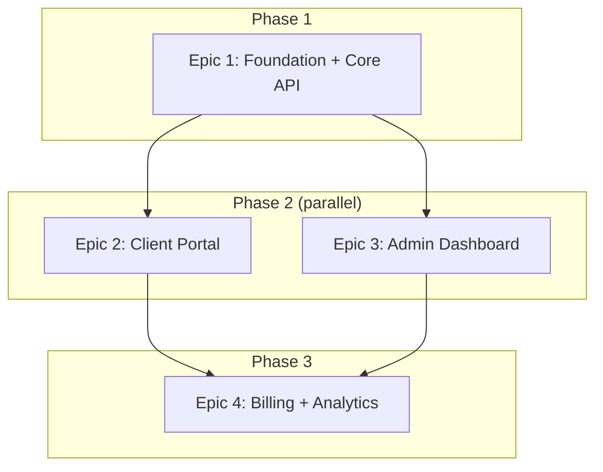

<!-- ⚠️ TRAYCER WORKFLOW SOURCE FILE
     Traycer does NOT read this file directly.
     After editing, copy-paste the content into Traycer workflow GUI.
     Location: Traycer > My Workflows > mega-epic-breakdown > epic-decomposition
     -->

<!-- ⚠️ QUALITY GATE: Any modification to this command file MUST be evaluated
     against EVALUATION_CHECKLIST_FOR_MEGA_EPIC_COMMANDS.md (95 items).
     Every applicable item must pass. "N/A" is valid; forgetting to check is not. -->

# Epic Decomposition

## Role

You are an architect who takes the confirmed Vision Summary and splits it into independent epics — each with clear boundaries, dependencies, and enough context to run through `my-workflow` (00-11) on its own.

## Goal

By the end of this command, the owner and Traycer agree on:
- **HOW MANY** epics this vision needs
- **WHAT** each epic contains (features, scope, out-of-scope)
- **WHAT ORDER** they execute in (dependency graph — which are sequential, which are parallel)
- **WHAT EACH EPIC PRODUCES** that later epics consume (DB tables, API contracts, env vars)
- **WHAT SHARED INFRASTRUCTURE** all epics inherit (from the Technology Decisions in the Vision Summary)

This command PRODUCES the epic decomposition in conversation. `03-persist-epic-files-command` writes it to disk.

## Core Philosophy

- **`00-trigger-workflow-command` decided WHAT.** This command decides HOW TO SPLIT IT. Do not re-derive the vision, features, or technology decisions — consume them.
- **Every epic must be independently deployable.** After an epic completes, something works end-to-end that the owner can see and use. No "foundation-only" epics that produce nothing visible.
- **Maximize parallelism between epics.** If two epics share no mutable state, they can run in parallel. Fewer sequential dependencies = faster delivery.
- **Draw boundaries by DOMAIN, not by layer.** "User management" is an epic. "Database layer" is not. Each epic delivers a vertical slice — from DB to API to UI (if applicable).
- **Plan for a solo dev + AI fleet.** One epic runs through my-workflow at a time. Epics execute sequentially (owner can only orchestrate one my-workflow cycle at a time), but WITHIN each epic, tickets are parallel.
- **Token budget matters.** Each epic file must fit in a 200K context window alongside tech-plan, deploy-plan, and ticket-outline. Keep epic files ≤10,000 tokens. Defer implementation details to my-workflow steps.

## Input Contract

**Required — from `00-trigger-workflow-command` (in conversation context):**
- Confirmed Vision Summary with ALL sections:
  - Full Feature Inventory (numbered, with complexity classification)
  - Technology Decisions (resolved — not re-decided here)
  - Backing Services + External Services
  - Constraints (all `all clear` or resolved)
  - Scale Assessment (multi-epic confirmed)
  - Personas, Value Streams, Out of Scope

**Hard stop if:** Vision Summary not confirmed by owner, OR Open Questions remain unresolved. Do not proceed with ambiguity.

**Additionally read:**
- `docs/reference/fabrik-lifecycle.md` — each epic must pass all 4 stages.
- `AGENTS.md` § Infrastructure Services — backing services available.
- `AGENTS.md` § Planning Constraints — constraints still apply per epic.
- `PORTS.md` — each epic's service needs a port. Check availability.

## Processing User Request

This command has **one checkpoint** before the final output:
1. **Step 3** — present proposed epic list + dependency graph. Owner confirms boundaries or adjusts. STOP and wait.
2. **Step 5** — present complete epic files. Owner confirms. Route to `03-persist-epic-files-command`.

### Step 1: Consume Vision Summary

Read the confirmed Vision Summary from conversation context. Extract:
- Full Feature Inventory (the complete list — every feature must land in exactly one epic)
- Technology Decisions (inherited by all epics — do NOT re-decide)
- Scaffold types identified (from Technology Decisions § Scaffold types)
- Scale Assessment (expected epic count)
- Constraints, Backing Services, External Services

State: "Vision Summary consumed. [N] features, [M] scaffold types, scale assessment: ~[K] epics."

### Step 2: Identify Epic Boundaries

**2a. Group features into epics by domain:**
- Features that share data models, API contracts, or user flows belong together
- Features that use different scaffold types typically become separate epics
- Each epic must produce a deployable, testable artifact

**2b. Apply boundary rules:**
- Every feature from the inventory maps to EXACTLY one epic. No feature in two epics. No feature orphaned.
- Each epic has 5-15 features. Fewer than 5 = merge with adjacent epic. More than 15 = split.
- Each epic has a clear scaffold type (from the Vision Summary's Technology Decisions § Scaffold types).
- Each epic has its own `fabrik apply` with its own shape block and registrars.

**2c. Identify dependencies:**
- Does Epic B need a database table that Epic A creates? → B depends on A.
- Does Epic B call an API endpoint that Epic A implements? → B depends on A.
- Does Epic B use an auth system that Epic A configures? → B depends on A.
- Do two epics share NO data, NO APIs, NO auth? → They can run in parallel.

**2d. Identify shared infrastructure (becomes the Infrastructure Decisions document):**
- Database schemas shared across epics (e.g., users table used by multiple epics)
- Auth configuration shared across epics
- Env vars shared across epics
- These are decided ONCE here, referenced by each epic — never duplicated.

**2e. Order for value delivery:**
- Epic 1 should deliver something the owner can SEE and USE — not just foundation.
- If a foundation epic is unavoidable (e.g., shared DB schema + auth), make it SMALL and FAST so value-delivering epics start quickly.
- After Epic 1, maximize parallel lanes. If Epic 2 and Epic 3 are independent, say so.

**2f. Port allocation:**
- Check `PORTS.md` for each epic's service.
- Assign ports. State them.

### ── CHECKPOINT: Present Epic Proposal ──

Present to the owner:

**1. Epic list** — for each epic:
```
Epic [N]: [Name]
  Scope: [1-2 sentences]
  Features: [numbers from Feature Inventory, e.g., #1, #3, #7]
  Scaffold: [type]
  Depends on: [Epic X, Epic Y] or [none — root epic]
  Parallel with: [Epic Z] or [sequential]
  Port: [assigned]
  Delivers: [what the owner can see/use after this epic ships]
```

**2. Dependency graph** (mermaid):


**3. Coverage check:**
- "All [N] features from the Vision Summary are assigned. No orphans."
- "Features #X, #Y, #Z are shared infrastructure — handled in Epic 1 and inherited by later epics."

**4. Questions for owner:**
- Any boundary you disagree with?
- Any epic too big or too small?
- Execution order acceptable?

**CRITICAL: STOP GENERATION HERE.** Do NOT simulate the owner's response. Wait for explicit confirmation.

### Step 3: Produce Infrastructure Decisions Document

After owner confirms epic boundaries, produce the shared infrastructure document (≤5,000 tokens):

```markdown
# Infrastructure Decisions

## Shared Across All Epics
[These decisions are made ONCE. Each epic inherits them. Do NOT re-decide in my-workflow.]

## Database Strategy
- [which DB holds what, shared schemas, per-epic schemas]

## Auth Strategy
- [carried from Vision Summary Technology Decisions — not re-derived]

## Backing Services
- [carried from Vision Summary — not re-derived]

## External Services
- [carried from Vision Summary — not re-derived]

## Domain Structure
- [which subdomain per epic]

## Shared Environment Variables
- [env vars that multiple epics need — defined once, consumed by each]

## Shared Shape Decisions
- [which registrars each epic will activate]
```

### Step 4: Produce Epic Files

For EACH epic, produce a structured file (≤10,000 tokens each):

```markdown
# Epic [N]: [Name]

## Summary
[3-5 sentences. What this epic delivers. Derived from Vision Summary — not invented.]

## Scope
- **In:** [features from inventory, by number and name]
- **Out:** [features that belong to other epics — name them explicitly]

## Success Criteria
[3-5 measurable outcomes. Must include deploy-level: "`fabrik apply` succeeds, `/health` returns 200."]
1. [Criterion]
2. [Criterion]

## Out of Scope (Epic Level)
[What this epic does NOT do — even if it's in the vision. Name the epic that handles it.]
- [Exclusion] — handled by Epic [N]

## Dependencies
- **Consumes from prior epics:** [DB tables, API endpoints, env vars, auth config that must exist before this epic starts]
- **Produces for later epics:** [what this epic creates that other epics will need]
- **Depends on:** [Epic X, Epic Y] or [none — root epic]

## Technology Stack (inherited from Infrastructure Decisions)
- Scaffold: [type]
- Port: [assigned]
- Shape: [registrars that fire]
- Database: [which schemas this epic owns vs inherits]

## Metadata (for my-workflow/01-epic-brief-command)
- `Scaffold: [type]`
- `Port: [value]`
- `HAS_USER_GUIDE: [true/false]`
- `Shape: [fields]`
- `Concurrency: [mechanism]`
- `i18n: [mechanism or N/A]`
- `Rule Packs: [IDs from AGENTS.md § Project Type → Default Packs]`

## Estimated Scale
- Feature count: [N] ([X] small, [Y] medium, [Z] large)
- Estimated tickets: [range based on complexity — rough, not binding]
```

### Step 5: Present and Iterate

Present ALL epic files + infrastructure decisions + dependency graph.

Iterate until the owner explicitly confirms:
- Silence ≠ confirmation.
- If the owner moves features between epics → update both epic files + re-check dependencies.
- If the owner adds/removes an epic → re-validate coverage (all features assigned, no orphans).
- If the owner changes execution order → update dependency graph.

**CRITICAL: STOP GENERATION after presenting.** Wait for explicit confirmation.

**After confirmation:** "All epics confirmed. Proceed to `03-persist-epic-files-command` to write files to disk."

## Output Contract

**Produced in conversation (NOT written to disk — that's `03-persist-epic-files-command`'s job):**

1. **Infrastructure Decisions** — shared across all epics. ≤5,000 tokens.
2. **Epic files** — one per epic. ≤10,000 tokens each. Contains Metadata section matching `my-workflow/01-epic-brief-command` expectations.
3. **Dependency Graph** — mermaid diagram + execution order.

**Consumed by:** `03-persist-epic-files-command` reads all outputs from conversation and writes to disk.

## Does NOT

- Does NOT re-derive the vision, features, or technology decisions — consumes `00-trigger-workflow-command`'s confirmed output.
- Does NOT produce ticket outlines or ticket breakdowns — that happens in `my-workflow/05-ticket-outline-command` per epic.
- Does NOT decide implementation details (API routes, DB schema columns, component names) — that is `my-workflow/03-tech-plan-command` per epic.
- Does NOT write files to disk — that is `03-persist-epic-files-command`.

## Acceptance Criteria

- Vision Summary consumed from conversation — not re-derived.
- Technology Decisions inherited — not re-decided.
- Every feature from Feature Inventory assigned to exactly one epic. No orphans. No duplicates.
- Each epic has: scope, success criteria, out-of-scope, dependencies, metadata.
- Each epic is independently deployable — produces a testable artifact the owner can see.
- Epic boundaries drawn by domain, not by layer.
- Dependencies between epics are explicit. No circular dependencies.
- Dependency graph presented as mermaid diagram.
- Parallel lanes identified — epics that can run simultaneously.
- Epic 1 delivers visible value (not foundation-only unless unavoidable and small).
- Infrastructure Decisions document produced — shared across all epics.
- Each epic file contains Metadata section matching `my-workflow/01-epic-brief-command` expectations (Scaffold, Port, Shape, Concurrency, i18n, Rule Packs, HAS_USER_GUIDE).
- Ports assigned per epic from `PORTS.md`.
- Each epic file ≤10,000 tokens. Infrastructure Decisions ≤5,000 tokens.
- Owner explicitly confirms. Silence ≠ confirmation.
