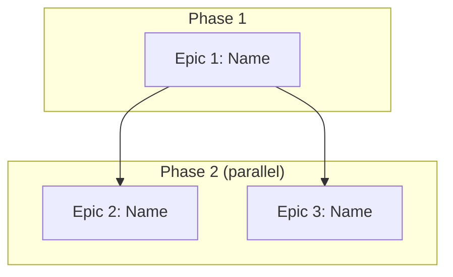

<!-- ⚠️ TRAYCER WORKFLOW SOURCE FILE
     Traycer does NOT read this file directly.
     After editing, copy-paste the content into Traycer workflow GUI.
     Location: Traycer > My Workflows > mega-epic-breakdown > epic-decomposition
     -->

<!-- ⚠️ QUALITY GATE: Any modification to this command file MUST be evaluated
     against EVALUATION_CHECKLIST_FOR_MEGA_EPIC_COMMANDS.md.
     Every applicable item must pass. "N/A" is valid; forgetting to check is not. -->

# Epic Decomposition

## Role

You are an architect who takes the confirmed Vision Summary and splits it into independent epics — each with clear boundaries, dependencies, and enough context to create a Traycer ticket in `03-expand-epic-files-command`.

## Goal

By the end of this command, the owner and Traycer agree on:
- **HOW MANY** epics this vision needs
- **WHAT** each epic contains (features, scope boundaries — compact format)
- **WHAT ORDER** they execute in (dependency graph — which are sequential, which are parallel)
- **WHAT EACH EPIC PRODUCES** that later epics consume (DB tables, API contracts, env vars)
- **WHAT SHARED INFRASTRUCTURE** all epics inherit (Infrastructure Decisions document)

This command produces the compact epic proposal + Infrastructure Decisions in conversation. `03-expand-epic-files-command` expands each epic into a Traycer ticket. `04-cross-epic-validation-command` validates cross-epic consistency. `05-dispatch-epic-tickets-command` dispatches tickets in dependency order.

## Core Philosophy

- **`00-trigger-workflow-command` decided WHAT.** This command decides HOW TO SPLIT IT. Do not re-derive the vision, features, or technology decisions — consume them.
- **Every epic must be independently deployable.** After an epic completes, something works end-to-end that the owner can see and use. No "foundation-only" epics that produce nothing visible.
- **Maximize parallelism between epics.** If two epics share no mutable state, they can run in parallel. Fewer sequential dependencies = faster delivery.
- **Draw boundaries by DOMAIN, not by layer.** "User management" is an epic. "Database layer" is not. Each epic delivers a vertical slice — from DB to API to UI (if applicable).
- **Plan for a solo dev + AI fleet.** One epic runs through epic-to-ticket-workflow at a time. Epics execute sequentially (owner can only orchestrate one epic-to-ticket-workflow cycle at a time), but WITHIN each epic, tickets are parallel.
- **Token budget matters.** This command stays lean — compact proposal, not full epic files. Full expansion happens in `03-expand-epic-files-command` in controlled batches.

## Input Contract

**Required — from `00-trigger-workflow-command` (in conversation context):**
- Confirmed Vision Summary with ALL sections:
  - Full Feature Inventory (numbered, with complexity classification)
  - Technology Decisions (resolved — not re-decided here)
  - Backing Services + External Services
  - Constraints (all `all clear` or resolved)
  - Scale Assessment (multi-epic confirmed)
  - Personas, Value Streams, Out of Scope

**Additional required input when 00 was in EXISTING mode (Vision Summary has these extra sections):**
- **Locked Decisions** — technology choices that cannot change (auth, database, frontend, billing, current shape block). These are inherited into Infrastructure Decisions § Auth Strategy / § Database Strategy / etc. **verbatim** — they are not re-decided here.
- **Compliance Report** — gap-by-gap table with owner decisions:
  - `fix-now` rows → emit one **Retrofit epic** per row (handled in Step 2b "Existing mode addition" below).
  - `fix-later` rows → surfaced in a "Deferred Compliance" appendix in the proposal; no epic emitted.
  - `accept-as-legacy` rows → surfaced in the same appendix; no epic emitted.

**Hard stop if:** Vision Summary not confirmed by owner, OR Open Questions remain unresolved. Do not proceed with ambiguity.

**Additionally read:**
- `docs/operations/fabrik-lifecycle.md` — deploy/runtime behavior & data safety (lifecycle stages 3–4). Each epic must still pass all 4 lifecycle stages: scaffold → implement → register (`fabrik apply`) → verify (`fabrik verify`).
- `AGENTS.md` § Infrastructure Services — backing services available.
- `AGENTS.md` § Planning Constraints — constraints still apply per epic.
- `PORTS.md` — each epic's service needs a port. Check availability.
- **Domain modules** — for EACH scaffold type identified in the Vision Summary's Technology Decisions, read the matching file from `domain-modules/`:
  - `saas-skeleton` → read `domain-modules/saas.md`
  - `mobile-app` → read `domain-modules/mobile-app.md`
  - `wordpress` → read `domain-modules/wordpress.md`
  - `chrome-extension` → read `domain-modules/chrome-ext.md`
  - If Vision Summary Technology Decisions includes **RAG pipeline** (any level) → read `domain-modules/rag.md`
  - Multi-scaffold vision (e.g., saas + mobile-app + chrome-extension) → read ALL matching modules. They inform epic patterns (mobile always has a "store submission" epic, SaaS always has "billing + tenant" epic, chrome-ext always has "backend API first, extension second" pattern, etc.). RAG module is additive — read it alongside scaffold modules when RAG is in scope.

## Processing User Request

This command has **one checkpoint** before the final confirmation:
1. **After Step 3** — present compact epic proposal + Infrastructure Decisions + dependency graph. Owner confirms boundaries, shared decisions, and execution order. STOP and wait.
2. **Step 4** — iterate if needed, then route to `03-expand-epic-files-command`.

### Step 1: Consume Vision Summary

Read the confirmed Vision Summary from conversation context. Extract:
- Full Feature Inventory (the complete list — every feature must land in exactly one epic)
- Technology Decisions (inherited by all epics — do NOT re-decide)
- Scaffold types identified (from Technology Decisions § Scaffold types)
- Scale Assessment (expected epic count)
- Constraints, Backing Services, External Services

**If the Vision Summary is from EXISTING mode (it has Locked Decisions + Compliance Report sections), also extract:**
- **Locked Decisions** → feed into Infrastructure Decisions in Step 3 (inherit verbatim; do NOT propose alternatives for locked areas).
- **Compliance Report** → every `fix-now` row becomes a Retrofit-epic input for Step 2b "Existing mode addition" below. `fix-later` and `accept-as-legacy` rows go to the "Deferred Compliance" appendix (presented at the checkpoint).

State: "Vision Summary consumed. [N] features, [M] scaffold types, scale assessment: ~[K] epics." If existing mode, also state: "Compliance Report consumed: [F] fix-now → Retrofit epics, [L] fix-later deferred, [A] accept-as-legacy noted."

### Step 2: Identify Epic Boundaries

**2a. Group features into epics by domain:**
- Features that share data models, API contracts, or user flows belong together
- Features that use different scaffold types typically become separate epics
- Each epic must produce a deployable, testable artifact

**2b. Apply boundary rules:**
- Every feature from the inventory maps to EXACTLY one epic. No feature in two epics. No feature orphaned.
- Each epic has 5-15 features. Fewer than 5 = merge with adjacent epic. More than 15 = split.
- Each epic has a clear scaffold type (from the Vision Summary's Technology Decisions § Scaffold types).
- Each epic has its own `fabrik apply` with its own shape block and registrars.

**Existing mode addition — emit Retrofit epics from the Compliance Report:**

For every `fix-now` row in the Vision Summary's Compliance Report, emit one **Retrofit epic** with:
- **Name:** prefix `"Retrofit: "` + the compliance area (e.g., `"Retrofit: i18n"`, `"Retrofit: Resilience on YouTube Data API"`).
- **Scope:** implement the compliance gap per the rule pack cited.
- **Features:** the corresponding `R<n>` rows from the Vision Summary's Feature Inventory (R1, R2, …).
- **Scaffold:** same as the project being continued (inherited from Locked Decisions § scaffold type).
- **Rule packs:** the rule pack(s) cited in the gap (e.g., `core/86-email-templates.md`, `saas/87-abuse-detection.md`).
- **HAS_USER_GUIDE:** inherited from the existing project (Locked Decisions).

Retrofit epics ARE epics — they count toward the 5–15 features rule (a small retrofit may be smaller; document the justification), they receive the **same dependency analysis** in 2c, and they pass through the **same parallel-classification gate** in 2c.

**Retrofit-epic dependency heuristics:**
- A Retrofit epic that fixes a foundation gap (e.g., i18n, auth hardening) typically runs **before** any delta-feature epic that would otherwise inherit the violation.
- A Retrofit epic on an isolated subsystem (e.g., Resilience layer on one external API) can be **parallel** with delta features that don't touch that subsystem.
- Apply the parallel gate (2c) the same way as for delta epics.

**`fix-later` and `accept-as-legacy` rows:** do NOT emit epics. Append them to the "Deferred Compliance" appendix presented at the checkpoint.

**2c. Identify dependencies:**
- Does Epic B need a database table that Epic A creates? → B depends on A.
- Does Epic B call an API endpoint that Epic A implements? → B depends on A.
- Does Epic B use an auth system that Epic A configures? → B depends on A.
- Does Epic B consume any shared service or infrastructure component (background processor, job queue, storage client, notification client, shared middleware, or any API module) that another epic scaffolds or creates? → B depends on THAT epic, regardless of where it sits in the draft execution order.
- Do two epics share NO data, NO APIs, NO services, NO auth, NO infrastructure components? → They can run in parallel.

**Parallel classification gate — run AFTER dependency detection, before finalizing any "parallel" label:**
For EVERY epic marked "parallel," produce one explicit verdict line in the proposal:

```text
[Epic N] parallel gate: PASS — consumes only [list artifacts] from [Epic X], which completes before this epic starts.
[Epic N] parallel gate: FAIL — consumes [artifact] from [Epic Y], which runs AFTER this epic → reclassified to depends-on: Epic Y.
```

FAIL = fix `depends-on`, re-run the gate for that epic, confirm PASS before finalizing.
Do NOT present the proposal until every parallel-labeled epic has a PASS verdict on record.

**2d. Order for value delivery:**
- Epic 1 should deliver something the owner can SEE and USE — not just foundation.
- If a foundation epic is unavoidable (e.g., shared DB schema + auth), make it SMALL and FAST so value-delivering epics start quickly.
- After Epic 1, maximize parallel lanes. If Epic 2 and Epic 3 are independent, say so.

**2e. Background processing check:**
- After grouping features, scan: does any feature require async/background processing (transcription, PDF generation, image processing, AI inference, data imports, batch operations, scheduled jobs, webhook-triggered pipelines)?
- If yes → these become either a dedicated `file-worker` epic OR a background-processing slice within the backend epic. Rule: never run heavy processing (>10s) inline in API handlers — it must go through the PostgreSQL job queue (per `core/75-workers-jobs.md`).
- If multiple heavy-processing features exist (e.g., transcription + image generation + report building), group them into a single "Worker Pipeline" epic rather than scattering across feature epics.

**2f. fabrik-lib check:**
- Before planning any new component from scratch, check `fabrik-lib/README.md` for a vendorable module that already solves it (copy, don't import). State: "fabrik-lib checked — [module used / no match]." If a module is used, add it to that epic's scope as a vendor step, not a build step.

**2g. Port allocation:**
- Check `PORTS.md` for each epic's service.
- Assign ports. State them.

**2h. Universal Coverage Check:**

Before drafting Infrastructure Decisions, audit the candidate epic set against the 14 universal categories defined in `docs/development/plans/2026-05-30-ai-watchdog-platform.md § What 02 will enforce after P4`. Each category is either (a) covered by an existing candidate epic, (b) covered by a Step 3 Infrastructure Decisions sub-section drafted in the next step, or (c) explicitly N/A because its trigger condition is false for this vision. Produce one verdict line per category. If any category is unassigned, return to 2a and revise the epic grouping before continuing — Step 3 must NOT proceed against an incomplete epic set.

**Emit 14 verdict lines in this shape:**

```text
[Category N: <name>] — trigger: <met | not met (<why>)> →
  status: COVERED by Epic <X> | ABSORBED in Step 3 § <name> | N/A — <reason>
  cites: <rule pack file path or vendor module>
```

**Per-category citation map (cite each verdict against the corresponding rule pack or fabrik-lib module):**

| # | Category | Trigger | Cite |
| --- | --- | --- | --- |
| 1 | Foundation | Always | scaffold sync, AI guardrails, `.windsurf/rules/` sync (via `fabrik fix`), `.env.example`, `project.yaml`, spec `shape:` block, `docs/RESILIENCE.md` |
| 2 | Features | Always (one or more per Vision § Full Feature Inventory) | Vision Summary |
| 3 | Persistence | `shape.needs_database` | `core/25-data-postgres.md` |
| 4 | Workers | If pipeline/async work | `core/75-workers-jobs.md` + `pause-state/` |
| 5 | External integrations | Any upstream API use | `core/58-resilience.md` + `async-http-client/circuit_breaker.py` + `upstream-quota/` |
| 6 | Self-healing | `shape.kind ∈ {service, worker, wordpress}` | `core/self-healing.md` |
| 7 | Watchdog wiring | `watchdog.enabled` (default per `kind`) | `core/60-watchdog.md` |
| 8 | Observability | Always | `core/55-observability.md` |
| 9 | Cost guardrails | Any LLM/paid-API use | `core/cost-budget.md` + `cost-budget/` |
| 10 | Deployment | Always | `core/30-ops.md` |
| 11 | Documentation | Always | `core/40-documentation.md` |
| 12 | Security | Always | `core/35-security-auth.md` + `saas/87-abuse-detection.md` (if signup) + `core/app-audit-log.md` |
| 13 | Testing | Always | `core/45-testing-strategy.md` |
| 14 | Retrofit | EXISTING mode only — one per `fix-now` Compliance Report row | Compliance Report from `00-trigger-workflow-command` Step E5 (consumed in 2b above) |

**Output produced by 2h into the proposal:**

1. A 14-line verdict block stored under the heading `### Universal Coverage Check` on the proposal.
2. For each "COVERED by Epic X" verdict: append `Universal categories: <numbers>` to that epic's compact entry so the operator can audit at a glance which categories each epic owns.
3. For each "ABSORBED in Step 3 § X" verdict: a stub-line in the Infrastructure Decisions document referencing the matching sub-section drafted in Step 3 (cross-link, not duplicate content).
4. For each "N/A" verdict: a one-line note kept inside the `### Universal Coverage Check` block (audit trail; does not pollute the epic set).

**Overlay-merge rule — apply AFTER the 14 verdicts (handles scaffold-type overlays loaded per Input Contract lines 62–68):**

For each loaded scaffold overlay, walk its Mandatory Epic Coverage rows (e.g., `domain-modules/saas.md § 1B Mandatory Epic Coverage`). For each overlay row:

- Identify which universal category(ies) the overlay row satisfies (e.g., "Billing + Gating" satisfies #4 Features AND #9 Cost Guardrails).
- If the universal category was COVERED by a candidate epic in 2a–2g AND the overlay row matches the same epic → **merge**: cite both in that epic's compact entry. No new epic created.
- If the universal category was COVERED by a different epic OR ABSORBED in Step 3 § X AND the overlay row demands its own epic → **add** the overlay's epic to the candidate set as a new entry; assign `Universal categories: <numbers>`; re-run 2c (dependency analysis) for the new epic before continuing.
- If the universal category was N/A but the overlay demands the coverage → flip the category to COVERED by the overlay's epic; update the 2h verdict line.

Loading is best-effort: if a scaffold type identified in the Vision Summary has no matching `domain-modules/<type>.md` file on disk (e.g., `docusaurus`, `static-site`), the read is a no-op — the universal-category check still runs (`watchdog` flips to N/A for `kind ∈ {static-site, docusaurus}` per `core/60-watchdog.md` matrix).

### Step 3: Draft Infrastructure Decisions

Produce the shared infrastructure document (≤5,000 tokens). These decisions are made ONCE here, referenced by each epic — never duplicated.

**Existing mode:** Sections of Infrastructure Decisions that overlap with `Locked Decisions` from the Vision Summary (Auth Strategy, Database Strategy, Frontend, Billing, current shape block) inherit those locked values **verbatim**. Do NOT propose alternative choices for locked areas. State the inheritance explicitly: e.g., *"**Auth Strategy:** Supabase Auth Pattern B (inherited from Locked Decisions — 1,800 active users, tokens issued)."* New decisions are only made for components the existing project did NOT have.

```markdown
# Infrastructure Decisions — Shared Across All Epics

[These decisions are made ONCE. Each epic inherits them.
Do NOT re-decide in epic-to-ticket-workflow. Do NOT copy into epic files.]

## Database Strategy
- [which DB holds what, shared schemas, per-epic schemas]
- [postgres-main / Supabase / both — carried from Vision Summary]

## Auth Strategy
- [carried from Vision Summary Technology Decisions — not re-derived]
- **Universal category #12 — Security.** Sensitive ops (auth events, billing mutations, admin actions, GDPR data-rights flows, watchdog Tier B/C actions) MUST write to the hash-chained audit log per `core/app-audit-log.md` + `app-audit-log/` vendor module. The Universal Coverage Check in 2h asserts both auth strategy and audit-log coverage; missing audit-log integration fails acceptance A1.

## Email Strategy
- [Transactional: Resend (default). Marketing: Resend Broadcasts → Listmonk+SES at scale.]
- [MUST be separate streams on separate subdomains (mail.<domain> vs news.<domain>)]

## Background Processing
- [Which epics need async workers? What operations? file-worker epic or backend slice?]
- [PG job queue per core/75-workers-jobs.md — never inline >10s processing]

## Embedding Model (if RAG/search features exist)
- [ONE model for the entire pipeline — both ingest and query. See `core/65-rag-search.md` § Embedding Models for current roster.]

## Backing Services
- [carried from Vision Summary — not re-derived]

## External Services
- [carried from Vision Summary — not re-derived]
- **Universal category #5 — External integrations.** Each entry above MUST have a corresponding row in the consuming epic's `docs/RESILIENCE.md` per `core/58-resilience.md § Per-Project Contract` (timeout, retry, circuit-breaker, fallback, error classifier). The Universal Coverage Check in 2h verifies this; missing rows fail acceptance A1.

## Domain Structure
- [URL routing, subdomains, path-based routing — whichever was decided]

## Shared Environment Variables
- [env vars that multiple epics need — defined once, consumed by each]
- [API keys for external services — list which epics need which keys]

## Shared Shape Decisions
- [which registrars each epic will activate]
```

### ── CHECKPOINT: Present Epic Proposal + Infrastructure Decisions ──

Present to the owner:

**1. Epic list** — for each epic (COMPACT format — full expansion happens in 03):
```
Epic [N]: [Name]
  Scope: [1-2 sentences]
  Features: [numbers from Feature Inventory, e.g., #1, #3, #7]
  Scaffold: [type]
  Depends on: [Epic X, Epic Y] or [none — root epic]
  Parallel with: [Epic Z] or [sequential]
  Port: [assigned]
  Delivers: [what the owner can see/use after this epic ships]
  Rule Packs: [IDs from .windsurf/rules/]
  HAS_USER_GUIDE: [true/false]
```

**2. Infrastructure Decisions** — the full document from Step 3.

**3. Dependency graph** (mermaid):


**4. Coverage check:**
- "All [N] features from the Vision Summary are assigned. No orphans. No duplicates."
- Table mapping every feature to its assigned epic.

**5. Execution order:**
- Numbered list showing recommended order (respecting dependencies).
- Parallel lanes noted.

**6. Deferred Compliance appendix (Existing mode only):**

```text
## Deferred Compliance (not actioned this run)

| Gap | Source | Owner decision |
|---|---|---|
| [gap] | [rule pack / detection] | fix-later |
| [gap] | [rule pack / detection] | accept-as-legacy |
```

Surface this even when empty (`"All compliance gaps actioned as Retrofit epics; nothing deferred."`) so the owner has explicit visibility.

**7. Questions for owner:**
- Any boundary you disagree with?
- Any epic too big or too small?
- Execution order acceptable?
- Infrastructure Decisions complete?
- (Existing mode) Retrofit-epic scope and ordering acceptable?
- (Existing mode) Deferred Compliance list accurate?

**CRITICAL: STOP GENERATION HERE.** Do NOT simulate the owner's response. Wait for explicit confirmation. Silence ≠ confirmation.

### Step 4: Iterate and Confirm

Iterate until the owner explicitly confirms:
- If the owner moves features between epics → update both entries + re-check dependencies + re-validate coverage.
- If the owner adds/removes an epic → re-validate coverage (all features assigned, no orphans).
- If the owner changes execution order → update dependency graph.
- If the owner adjusts Infrastructure Decisions → update the document.

**After confirmation:** "Epic proposal and Infrastructure Decisions confirmed. Proceed to `03-expand-epic-files-command` to create one Traycer ticket per epic."

## Output Contract

**Produced as Traycer specs (persisted in Traycer's spec store, readable via `read_spec`):**

1. **Compact Epic Proposal** — one entry per epic (delta-feature epics + **Retrofit epics** if Existing mode) with: scope, features, scaffold, dependencies, parallel lanes, port, delivers, rule packs, HAS_USER_GUIDE.
2. **Infrastructure Decisions** — shared across all epics. ≤5,000 tokens. In Existing mode, overlapping sections inherit Locked Decisions verbatim.
3. **Dependency Graph** — mermaid diagram + execution order. Retrofit epics receive dependency analysis identical to delta epics.
4. **Coverage Check** — every feature mapped to exactly one epic.
5. **Deferred Compliance appendix (Existing mode only)** — Compliance Report rows the owner classified as `fix-later` or `accept-as-legacy`. Surfaced for owner awareness; produces no epics.

**NOT produced here (deferred to 03-expand-epic-files-command):**

- Full epic tickets with detailed scope, success criteria, out-of-scope, dependencies listing specific artifacts, metadata blocks.

**Consumed by:** `03-expand-epic-files-command` reads the compact proposal + Infrastructure Decisions via `read_spec` and expands each epic into a Traycer ticket.

## Does NOT

- Does NOT re-derive the vision, features, or technology decisions — consumes `00-trigger-workflow-command`'s confirmed output.
- Does NOT produce full epic tickets — that is `03-expand-epic-files-command`. This command produces the compact proposal only.
- Does NOT produce ticket outlines or ticket breakdowns — that happens in `epic-to-ticket-workflow/05-ticket-outline-command` per epic.
- Does NOT decide implementation details (API routes, DB schema columns, component names) — that is `epic-to-ticket-workflow/03-tech-plan-command` per epic.
- Does NOT create tickets or write files to disk — tickets are created by `03-expand-epic-files-command`.

## Acceptance Criteria

- Vision Summary consumed from conversation — not re-derived.
- Technology Decisions inherited — not re-decided.
- Every feature from Feature Inventory assigned to exactly one epic. No orphans. No duplicates.
- Each epic entry has: scope summary, feature list, scaffold, dependencies, parallel lanes, port, delivers, rule packs, HAS_USER_GUIDE.
- Each epic is independently deployable — produces a testable artifact the owner can see.
- Epic boundaries drawn by domain, not by layer.
- Dependencies between epics are explicit. No circular dependencies.
- Dependency graph presented as mermaid diagram with execution order.
- Parallel lanes identified — epics that can run simultaneously.
- Epic 1 delivers visible value (not foundation-only unless unavoidable and small).
- Infrastructure Decisions document produced — shared across all epics, ≤5,000 tokens.
- Ports assigned per epic from `PORTS.md`.
- Compact proposal format — NOT full epic files (those come in 03).
- Owner explicitly confirms. Silence ≠ confirmation.

**Existing mode adds:**
- Locked Decisions consumed from Vision Summary and inherited verbatim into Infrastructure Decisions § Auth Strategy / § Database Strategy / § Frontend / § Billing / § Shared Shape Decisions. Not re-decided.
- Compliance Report consumed: one Retrofit epic emitted per `fix-now` row. Retrofit epics receive the same dependency analysis as delta-feature epics and pass through the parallel-classification gate.
- `fix-later` and `accept-as-legacy` rows surfaced in the "Deferred Compliance" appendix — produce no epics.
- Retrofit epic names prefixed `"Retrofit: "`.
