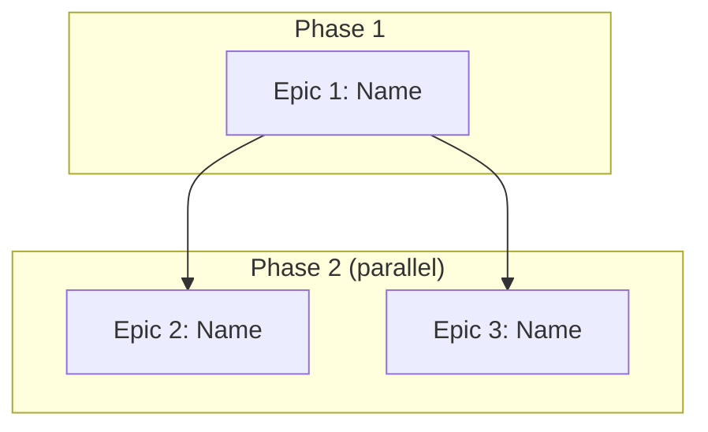

<!-- ⚠️ FABRIK ORCHESTRATOR COMMAND — OUR OWN TWIN OF `02-epic-decomposition-command.md`
     Unlike the Traycer source, our orchestrator READS THIS FILE DIRECTLY — no GUI copy-paste.
     It is TOOL-CAPABLE: it can read the repo, run commands, and fetch live sources.
     Keep it in lockstep with the Traycer twin; the ONLY intended differences are
     (a) the orchestrator framing and (b) the tool-capable inheritance from `00-trigger-fabrik`.

     ⚠️ The decomposition JUDGMENT — where the epic boundaries fall — is SINGLE-AGENT Opus work: never
     fan THAT out (the optional consistency-check fanout below is a different activity, and is allowed)
     `[canonical: docs/superpowers/specs/2026-07-16-traycer-fabrik-twins-design.md § Capability delta —
     "mega-02's decomposition is single-agent judgment (+ optional grounder fan-out for its consistency
     checks)"]`. There is no research leg here: the Vision Summary arrives already live-grounded by
     `00-trigger-fabrik`'s ⛔BLOCKING N3k gate. The 2h rule-pack citation audit MAY dispatch a read-only
     `fanout("review", …, mode="read_only")` consistency check — optional, never owed; the verdicts stay yours.

     Reads — this list is the ACTING set. Every other backticked path below is provenance for a decision
     already stated inline: act on the inline statement, and open the source only if it is insufficient
     (if it IS insufficient, that is a defect in this file — report it, don't quietly absorb the cost):
       · the confirmed **Vision Summary** — from conversation context, not disk (Step 1)
       · `agents-fabrik.md` § Infrastructure Services (backing services available) + § Planning Constraints
         — all 12 still apply per epic `[canonical: agents-fabrik.md § Planning Constraints — the 12; 7 of
         them are also N3i checks, see 00-trigger-fabrik]`
       · `docs/operations/fabrik-lifecycle.md` — deploy/runtime behavior + data safety (it covers the
         detail of stages 3–4; it carries no stage model of its own)
       · `PORTS.md` — every epic's service needs a port (Step 2g)
       · the **domain rule pack per scaffold type** the Vision Summary names — read BY PATH (full paths;
         they are what you open): `.windsurf/rules/saas/00-domain-saas.md` ·
         `.windsurf/rules/mobile-app/00-domain-mobile-app.md` ·
         `.windsurf/rules/desktop-app/00-domain-desktop-app.md` ·
         `.windsurf/rules/chrome-ext/00-domain-chrome-ext.md`.
         ⚠️ All four are `activation: manual` with NO frontmatter `globs:`, and `select_rules.py` selects
         on `globs:` ALONE — `:24-39` parses only `globs:`/`description:`, and `:108` branches on
         `any(_glob_has_match(...))`, which is False for an empty glob list; `activation:` is never read.
         So they are AVAILABLE forever and `select_rules.py` will NEVER surface them: open them by path
         or silently miss them.
       · `.windsurf/rules/core/65-rag-search.md` § Epic Decomposition — only when the vision names
         RAG/search (this one IS glob-activated, so `select_rules.py` surfaces it on a matching project)
       · `/opt/fabrik-lib/README.md` § Modules + each candidate module's own `README.md` — resolve modules
         from the index, and read the module's README for its CURRENT API + cap defaults (never copy a
         signature or a default value into an epic ticket; they drift)
       · the CURRENT-VALUE live-reads (never quote a remembered number): `src/fabrik/spec_loader.py`
         `WatchdogConfig` · `templates/<type>/defaults.yaml` (the `kind:` contract)
     -->

<!-- ⚠️ QUALITY GATE: Any modification to this command file MUST be evaluated
     against EVALUATION_CHECKLIST_FOR_MEGA_EPIC_COMMANDS.md.
     Every applicable item must pass. "N/A" is valid; forgetting to check is not. -->

# Epic Decomposition

## Role

You are an architect who takes the confirmed Vision Summary and splits it into independent epics — each with clear boundaries, dependencies, and enough context to create an epic ticket in `03-expand-epic-files-fabrik`.

## Goal

By the end of this command, the owner and our orchestrator agree on:
- **HOW MANY** epics this vision needs
- **WHAT** each epic contains (features, scope boundaries — compact format)
- **WHAT ORDER** they execute in (dependency graph — which are sequential, which are parallel)
- **WHAT EACH EPIC PRODUCES** that later epics consume (DB tables, API contracts, env vars)
- **WHAT SHARED INFRASTRUCTURE** all epics inherit (Infrastructure Decisions document)

This command produces the compact epic proposal + Infrastructure Decisions in conversation. `03-expand-epic-files-fabrik` expands each epic into an epic ticket. `04-cross-epic-validation-fabrik` validates cross-epic consistency. `05-dispatch-epic-tickets-fabrik` dispatches tickets in dependency order.

## Core Philosophy

- **`00-trigger-fabrik` decided WHAT.** This command decides HOW TO SPLIT IT. Do not re-derive the vision, features, or technology decisions — consume them.
- **Every epic must be independently deployable.** After an epic completes, something works end-to-end that the owner can see and use. No "foundation-only" epics that produce nothing visible.
- **Maximize parallelism between epics.** If two epics share no mutable state, they can run in parallel. Fewer sequential dependencies = faster delivery.
- **Draw boundaries by DOMAIN, not by layer.** "User management" is an epic. "Database layer" is not. Each epic delivers a vertical slice — from DB to API to UI (if applicable).
- **Plan for a solo dev + AI fleet.** One epic runs through epic-to-ticket-workflow at a time. Epics execute sequentially (owner can only orchestrate one epic-to-ticket-workflow cycle at a time), but WITHIN each epic, tickets are parallel.
- **Token budget matters.** This command stays lean — compact proposal, not full epic files. Full expansion happens in `03-expand-epic-files-fabrik` in controlled batches.

## Input Contract

**Required — from `00-trigger-fabrik` (in conversation context):**
- Confirmed Vision Summary with ALL sections (✅ **`fabrik-lib Verdict`** and **`Rejected Alternatives`** are ALWAYS present on this path — `00-trigger-fabrik`'s ⛔BLOCKING N3k gate emits both. **Inherit them; never re-litigate a Rejected Alternative, never re-run the ladder.** If either is missing, the upstream gate did not run: stop and say so):
  - Product Vision (the 3–5 sentence framing — quoted verbatim into Epic 1's Summary if it's a delivery epic)
  - Personas, Value Streams
  - Full Feature Inventory (numbered, with complexity classification)
  - Backing Services + External Services
  - Technology Decisions (resolved — not re-decided here)
  - Constraints (all `all clear` or resolved)
  - `## Out of Scope (Vision Level)` — the **literal heading** 00 emits in both modes. Any feature listed there MUST NOT appear in any epic.
  - Open Questions (MUST be empty / all marked resolved or explicitly deferred — see Hard stop below)
  - Scale Assessment (multi-epic confirmed)

**Additional required input when 00 was in EXISTING mode (Vision Summary has these extra sections):**
- **Locked Decisions** — technology choices that cannot change (the four `00-trigger-fabrik` names by default — auth, database, frontend, current shape block — **plus** whatever its `[etc.]` bullet adds; the section is extensible, so read what actually arrived rather than assuming the four). These are inherited into Infrastructure Decisions **verbatim**: auth → § Auth Strategy, database → § Database Strategy, frontend + shape → § Shared Shape Decisions (there is no § Frontend section), billing → § External Services. See Step 3 for the full overlap rule — they are not re-decided here.
- **Compliance Report** — gap-by-gap table with owner decisions:
  - `fix-now` rows → emit one **Retrofit epic** per row (handled in Step 2b "Existing mode addition" below).
  - `fix-later` rows → surfaced in a "Deferred Compliance" appendix in the proposal; no epic emitted.
  - `accept-as-legacy` rows → surfaced in the same appendix; no epic emitted.

**Hard stop if:** Vision Summary not confirmed by owner, OR Open Questions remain unresolved. Do not proceed with ambiguity.

**Additionally read:**
- `docs/operations/fabrik-lifecycle.md` — deploy/runtime behavior & data safety (lifecycle stages 3–4). Each epic must still pass all 4 lifecycle stages: scaffold → implement → register (`fabrik apply`) → verify (`fabrik verify`). ⚠️ **Exception — Retrofit epics:** a Retrofit on an already-deployed service creates **no new deploy unit**, so it has no Stage-1/Stage-3 of its own; its stage-3 equivalent is `python scripts/final_gate.py --json` green (the FULL Tier-2 gate) + the rule-pack gap moving to Compliant (per `03-expand-epic-files-fabrik`). State this exception inline on any Retrofit epic.
- `agents-fabrik.md` § Infrastructure Services — backing services available.
- `agents-fabrik.md` § Planning Constraints — constraints still apply per epic.
- `PORTS.md` — each epic's service needs a port. Check availability.
- **Domain packs** — for EACH scaffold type identified in the Vision Summary, read the matching **rule pack** (the single source of truth; `domain-modules/` was deleted 2026-07-14 after it drifted — it had inverted the chrome-ext build-tool default and told planners the registrar creates pgvector indexes, which it does not):
  - `saas-skeleton` → `.windsurf/rules/saas/00-domain-saas.md` (17 vision-intake dimensions + epic coverage)
  - `mobile-app` → `.windsurf/rules/mobile-app/00-domain-mobile-app.md` (17 dimensions + attribution + the 3 forks)
  - `desktop-app` → `.windsurf/rules/desktop-app/00-domain-desktop-app.md` (vision intake + the standalone-vs-connected fork, which decides whether revenue can be gated at all; Epic 1)
  - `chrome-extension` → `.windsurf/rules/chrome-ext/00-domain-chrome-ext.md` (vision intake + the permission-ceiling fork; backend API is always Epic 1)
  - `wordpress` → **out of scope for this workflow** — route to `/opt/wpf`. There is no pack and no module.
  - RAG / search in Technology Decisions → `.windsurf/rules/core/65-rag-search.md` § Epic Decomposition (⚠️ read its warning: **every RAG epic must carry its own `CREATE EXTENSION` + HNSW migration** — no registrar does it)

## Processing User Request

This command has **one checkpoint** before the final confirmation:
1. **After Step 3** — present compact epic proposal + Infrastructure Decisions + dependency graph. Owner confirms boundaries, shared decisions, and execution order. STOP and wait.
2. **Step 4** — iterate if needed, then route to `03-expand-epic-files-fabrik`.

### Step 1: Consume Vision Summary

Read the confirmed Vision Summary from conversation context. Extract:
- Full Feature Inventory (the complete list — every feature must land in exactly one epic)
- Technology Decisions (inherited by all epics — do NOT re-decide)
- Scaffold types identified (from Technology Decisions § Scaffold types)
- Scale Assessment (expected epic count)
- Constraints, Backing Services, External Services

**If the Vision Summary is from EXISTING mode (it has Locked Decisions + Compliance Report sections), also extract:**
- **Locked Decisions** → feed into Infrastructure Decisions in Step 3 (inherit verbatim; do NOT propose alternatives for locked areas).
- **Compliance Report** → every `fix-now` row becomes a Retrofit-epic input for Step 2b "Existing mode addition" below. `fix-later` and `accept-as-legacy` rows go to the "Deferred Compliance" appendix (presented at the checkpoint).

State: "Vision Summary consumed. [N] features, [M] scaffold types, scale assessment: ~[K] epics." If existing mode, also state: "Compliance Report consumed: [F] fix-now → Retrofit epics, [L] fix-later deferred, [A] accept-as-legacy noted."

### Step 2: Identify Epic Boundaries

**2a. Group features into epics by domain:**
- Features that share data models, API contracts, or user flows belong together
- Features that use different scaffold types typically become separate epics
- Each epic must produce a deployable, testable artifact

**2b. Apply boundary rules:**
- **Epic-count sanity band:** 3–7 epics is typical. **≥10** → re-examine the boundaries; you are almost certainly splitting by *layer*, not by *domain*. **≤2** → this vision probably belongs in `epic-to-ticket-workflow` directly — **unless** N3e's under-8 band forced 2 epics because 2+ features are large, which is a legitimate 2-epic split, not a mis-split. State the band verdict at the Checkpoint.
- Every feature from the inventory maps to EXACTLY one epic. No feature in two epics. No feature orphaned.
- Each epic targets 5–15 features. Fewer than 5 = merge with adjacent epic UNLESS one of these exceptions holds, document the justification inline: (a) the epic is a Retrofit epic (small retrofits permitted per 2b); (b) **the sub-5 epic is a real domain, not a residue** — answer the question the merge rule actually asks: *"why can't this live inside an adjacent epic?"* It earns (b) only if folding it into EVERY adjacent epic would either break that epic's domain coherence or push it past 15 features. ⚠️ Deliberately QUALITATIVE — no feature-count arithmetic can settle it: boundaries are drawn by DOMAIN, not by size (§ Core Philosophy), so every threshold is either gameable by re-slicing or punishes an honest domain split. (Note "has a deployable artifact" is NOT the test — 2a already requires that of every epic, so it discriminates nothing.) Worked: a 16-feature vision whose real domains are `7/4/3/2` keeps all four when the 2 is, say, a billing surface that fits inside none of the other three — an arithmetic rule would have force-merged it, and a "balance" rule would have rewarded re-cutting into a mechanical `4/4/4/4`, which is layer-slicing wearing a domain label. Conversely, in `5/5/5/1` where the 1 is a stray screen belonging to one of the 5s, it folds in; in `30 → 15/3/3/3/2/2/2` where the 3s and 2s are layers carved off the 15, they fold back. Sanity-check the epic count against N3e's routed band and say so if you deviate — the band is a signal, not a cap: **you** own the split; (c) a scaffold-specific overlay mandates a small dedicated epic (e.g., mobile-app "store submission" epic). More than 15 = split.
- Each epic has a clear scaffold type (from the Vision Summary's Technology Decisions § Scaffold types).
- Each epic has its own `fabrik apply` with its own shape block and registrars.

**Existing mode addition — emit Retrofit epics from the Compliance Report:**

For every `fix-now` row in the Vision Summary's Compliance Report, emit one **Retrofit epic** with:
- **Name:** prefix `"Retrofit: "` + the compliance area (e.g., `"Retrofit: i18n"`, `"Retrofit: Resilience on YouTube Data API"`).
- **Scope:** implement the compliance gap per the rule pack cited.
- **Features:** the corresponding `R<n>` rows from the Vision Summary's Feature Inventory (R1, R2, …).
- **Scaffold:** same as the project being continued. ⚠️ The Vision Summary carries **no** existing-scaffold-type field — Locked Decisions has none, and Technology Decisions § Scaffold types lists only the NEW types the capability adds. So: no new type named ⇒ the continued project's own type, unchanged. Do not invent a Locked Decisions § scaffold type.
- **Rule packs:** the rule pack(s) cited in the gap (e.g., `core/86-email-templates.md`, `saas/87-abuse-detection.md`).
- **HAS_USER_GUIDE:** inherited from the existing project — a `03-expand-epic-files-fabrik` Metadata field, NOT a Locked Decision (00 emits no such field). A retrofit does not change it: carry the project's current value.

Retrofit epics ARE epics — they count toward the 5–15 features rule (a small retrofit may be smaller; document the justification), they receive the **same dependency analysis** in 2c, and they pass through the **same parallel-classification gate** in 2c.

**Retrofit-epic dependency heuristics:**
- A Retrofit epic that fixes a foundation gap (e.g., i18n, auth hardening) typically runs **before** any delta-feature epic that would otherwise inherit the violation.
- A Retrofit epic on an isolated subsystem (e.g., Resilience layer on one external API) can be **parallel** with delta features that don't touch that subsystem.
- Apply the parallel gate (2c) the same way as for delta epics.

**`fix-later` and `accept-as-legacy` rows:** do NOT emit epics. Append them to the "Deferred Compliance" appendix presented at the checkpoint.

**2c. Identify dependencies:**
- Does Epic B need a database table that Epic A creates? → B depends on A.
- Does Epic B call an API endpoint that Epic A implements? → B depends on A.
- Does Epic B use an auth system that Epic A configures? → B depends on A.
- Does Epic B consume any shared service or infrastructure component (background processor, job queue, storage client, notification client, shared middleware, or any API module) that another epic scaffolds or creates? → B depends on THAT epic, regardless of where it sits in the draft execution order.
- Do two epics share NO data, NO APIs, NO services, NO auth, NO infrastructure components? → They can run in parallel.

**Parallel classification gate — run AFTER dependency detection, before finalizing any "parallel" label.**

⚠️ A `parallel` label is a **concurrency contract**, not a scheduling hint: it asserts that two agent teams could execute both epics **at the same time, in the same repo, without colliding**. Three checks must ALL pass. Historically only the first existed — which meant two "parallel" epics could be cleared to run while both rewrote `src/auth/` and both added an Alembic head.

For EVERY epic marked `parallel`, emit **three** verdict lines:

```text
[Epic N] parallel gate 1/3 — ARTIFACTS: PASS — consumes only [artifacts] from [Epic X], which completes before this epic starts.
[Epic N] parallel gate 2/3 — FILE SCOPE: PASS — Owned paths {src/billing/**, tests/billing/**} are disjoint from every co-parallel epic's.
[Epic N] parallel gate 3/3 — MIGRATIONS: PASS — this epic owns no migrations; Epic 1 is the sole migration owner in this parallel set.
```

**1/3 ARTIFACTS** (consumption) — FAIL if the epic consumes an artifact produced by an epic that runs *after* it → fix `depends-on`, re-run.

**2/3 FILE SCOPE** (disjointness) — intersect this epic's `Owned paths:` with those of **every** epic it is `Parallel with:`. Any overlap → **FAIL**. Two agents writing one file is a merge conflict by construction, and the fact that neither consumes the other's *artifacts* does not save them.
FAIL = either **re-cut the epic boundaries** so the paths are disjoint (preferred — an overlap usually means the boundary was drawn by layer, not by domain), or **reclassify to sequential**. Never "parallel with a note to be careful."

**3/3 MIGRATIONS** (single owner) — at most **ONE** epic in any parallel set may own schema migrations (`alembic/versions/**`, `db/schema.sql`). Two epics landing concurrent Alembic heads race the version table and **wedge the deploy** — this is 12-Factor XII, and it is not a merge conflict you can see in a diff.
FAIL = the epic that does not own the schema **depends-on** the one that does. There is no "we'll merge the migrations later."

FAIL on ANY of the three = fix, re-run all three for that epic, confirm PASS.
Do NOT present the proposal until every parallel-labeled epic has **three** PASS verdicts on record.

> **Why this matters beyond planning:** the operator's requirement is to run *multiple agents in one project concurrently, on different scopes, without touching the same files* (`docs/traycer/00-autonomous-factory-north-star.md` R16). `Owned paths:` is what makes that checkable — and it is what the future driver will hand each worker as its `File Scope (owned paths)`. A `parallel` label with no disjointness proof is a promise the repo cannot keep.

**2d. Order for value delivery:**
- State the **CRITICAL PATH** — the longest sequential epic chain — as e.g. `Critical path: Epic 1 → Epic 3 → Epic 5 (3 deep)`. Present it at the Checkpoint.
- For **each epic on that path**, state `SPLIT-CANDIDATE: yes (<how>) / no (<why>)`. A critical-path epic that can be split into a blocking half and a non-blocking half **MUST** be split — that is the only way to shorten delivery.
- Epic 1 should deliver something the owner can SEE and USE — not just foundation.
- If a foundation epic is unavoidable (e.g., shared DB schema + auth), make it SMALL and FAST so value-delivering epics start quickly.
- After Epic 1, maximize parallel lanes. If Epic 2 and Epic 3 are independent, say so.

**2e. Background processing check:**
- After grouping features, scan: does any feature require async/background processing (transcription, PDF generation, image processing, AI inference, data imports, batch operations, scheduled jobs, webhook-triggered pipelines)?
- If yes → these become either a dedicated `file-worker` epic OR a background-processing slice within the backend epic. Rule: never run heavy processing (>10s) inline in API handlers — it must go through the PostgreSQL job queue (per `core/75-workers-jobs.md`).
- If multiple heavy-processing features exist (e.g., transcription + image generation + report building), group them into a single "Worker Pipeline" epic rather than scattering across feature epics.

**2f. fabrik-lib inheritance (do NOT re-run the ladder):**
- The Vision Summary from `00-trigger-fabrik` already ran the full **vendor→enhance→build ladder** per capability and recorded it as a **`## fabrik-lib Verdict`** table. **Inherit those rows** — copy each matching verdict into the owning epic's scope as a *vendor* step, not a *build* step. Do NOT re-litigate a row.
- Run the ladder here **only** for a capability the Verdict table does not cover — and say which. ✅ Our `00-trigger-fabrik` **always** emits the Verdict table (its ⛔BLOCKING N3k gate produces it), so the Traycer-twin fallback does not apply on this path — if the table is missing, the upstream run did not complete its gate: **stop and say so**, do not silently re-derive it.
- Otherwise: check `fabrik-lib/README.md` for a vendorable module that already solves it (copy, don't import). State: "fabrik-lib checked — [module used / no match]." If a module is used, add it to that epic's scope as a vendor step, not a build step.

**2g. Port allocation:**
- Check `PORTS.md` for each epic's service.
- Assign ports. State them.

**2h. Universal Coverage Check:**

Before drafting Infrastructure Decisions, audit the candidate epic set against the 14 universal categories — **this command is the authoritative source** for the category list (table immediately after this paragraph). The original platform plan that introduced these categories now lives at `docs/development/plans/archived/2026-05-30-ai-watchdog-platform.md` (archived; historical context only — do NOT cite it as authority). Each category is either (a) covered by an existing candidate epic, (b) covered by a Step 3 Infrastructure Decisions sub-section drafted in the next step, or (c) explicitly N/A because its trigger condition is false for this vision. Produce one verdict line per category. If any category is unassigned, return to 2a and revise the epic grouping before continuing — Step 3 must NOT proceed against an incomplete epic set.

**Emit 14 verdict lines in this shape:**

```text
[Category N: <name>] — trigger: <met | not met (<why>)> →
  status: COVERED by Epic <X> | ABSORBED in Step 3 § <name> | N/A — <reason>
  cites: <rule pack file path or vendor module>
```

**Per-category citation map (cite each verdict against the corresponding rule pack or fabrik-lib module):**

| # | Category | Trigger | Cite |
| --- | --- | --- | --- |
| 1 | Foundation | Always | scaffold sync, AI guardrails, `.windsurf/rules/` sync (via `fabrik fix`), `.env.example`, `project.yaml`, spec `shape:` block, `docs/RESILIENCE.md` |
| 2 | Features | Always (one or more per Vision § Full Feature Inventory) | Vision Summary |
| 3 | Persistence | `shape.needs_database` | `core/25-data-postgres.md` |
| 4 | Workers | If pipeline/async work | `core/75-workers-jobs.md` (+ vendor the queue / pause-state primitives — resolve the current module from the fabrik-lib index) |
| 5 | External integrations | Any upstream API use | `core/58-resilience.md` (+ vendor the circuit-breaker and upstream rate-limit/quota primitives — resolve the current modules from the fabrik-lib index) |
| 6 | Self-healing | `shape.kind ∈ {service, worker}` (wordpress is out-of-scope for this workflow per `00-trigger-fabrik` Step N3j — `Kind.WORDPRESS` exists in `spec_loader.py` for the standalone `/opt/wpf` project, never reaches 02 here) | `core/self-healing.md` |
| 7 | Watchdog wiring | `watchdog.enabled` — **ON by default, opt-OUT**; there is **no** `kind` test in the resolver (`infrastructure.py:314`) | `core/60-watchdog.md` |
| 8 | Observability | Always | `core/55-observability.md` |
| 9 | Cost guardrails | Any LLM/paid-API use | `core/cost-budget.md` (+ vendor the cost-ledger module — resolve from the fabrik-lib index) |
| 10 | Deployment | Always | `core/30-ops.md` |
| 11 | Documentation | Always | `core/40-documentation.md` |
| 12 | Security | Always | `core/35-security-auth.md` + `saas/87-abuse-detection.md` (if signup) + `core/app-audit-log.md` |
| 13 | Testing | Always | `core/45-testing-strategy.md` |
| 14 | Retrofit | EXISTING mode only — one per `fix-now` Compliance Report row | Compliance Report from `00-trigger-fabrik` (authored in Step E3.A–C; Step E5 only emits it) (consumed in 2b above) |

Rule-pack paths above are cited directly. **fabrik-lib modules are resolved from the index** (`/opt/fabrik-lib/README.md` § Modules) — never from a name written here.

**Output produced by 2h into the proposal:**

1. A 14-line verdict block stored under the heading `### Universal Coverage Check` on the proposal.
2. For each "COVERED by Epic X" verdict: append `Universal categories: <numbers>` to that epic's compact entry so the operator can audit at a glance which categories each epic owns.
3. For each "ABSORBED in Step 3 § X" verdict: a stub-line in the Infrastructure Decisions document referencing the matching sub-section drafted in Step 3 (cross-link, not duplicate content).
4. For each "N/A" verdict: a one-line note kept inside the `### Universal Coverage Check` block (audit trail; does not pollute the epic set).

**Overlay-merge rule — apply AFTER the 14 verdicts (handles scaffold-type overlays loaded per § Input Contract → **Domain packs**):**

For each loaded **domain pack**, walk its mandatory-coverage section. The exact heading per pack (verified 2026-07-14 — do NOT guess, and do not search for the retired `domain-modules/*.md` filenames):

| Loaded pack | Walk this section |
|---|---|
| `.windsurf/rules/saas/00-domain-saas.md` | `### Mandatory Epic Coverage` |
| `.windsurf/rules/mobile-app/00-domain-mobile-app.md` | `#### Mandatory Epic Coverage` |
| `.windsurf/rules/chrome-ext/00-domain-chrome-ext.md` | `### Mandatory Epic Coverage` |
| `.windsurf/rules/desktop-app/00-domain-desktop-app.md` | `### Mandatory Epic Coverage` |
| `.windsurf/rules/core/65-rag-search.md` | `## Epic Decomposition (PLANNING layer — read before any RAG epic exists)` (its directives are inline — no separate coverage table) |

If a heading above is not present in the pack you loaded, the pack has moved: STOP and report it rather than improvising a substitute. For each overlay row:

- Identify which universal category(ies) the overlay row satisfies (e.g., "Billing + Gating" satisfies #2 Features AND #9 Cost Guardrails).
- If the universal category was COVERED by a candidate epic in 2a–2g AND the overlay row matches the same epic → **merge**: cite both in that epic's compact entry. No new epic created.
- If the universal category was COVERED by a different epic OR ABSORBED in Step 3 § X AND the overlay row demands its own epic → **add** the overlay's epic to the candidate set as a new entry; assign `Universal categories: <numbers>`; re-run 2c (dependency analysis) for the new epic before continuing.
- If the universal category was N/A but the overlay demands the coverage → flip the category to COVERED by the overlay's epic; update the 2h verdict line.

Loading is best-effort: if a scaffold type identified in the Vision Summary has no matching domain pack file on disk (e.g., `docusaurus`, `static-site`), the read is a no-op — the universal-category check still runs (per the `core/60-watchdog.md` matrix, `watchdog` is N/A for the `static-site` and `docusaurus` **scaffold types**, i.e. `kind: static` — note that is operator discipline, not a resolver rule; see § Watchdog Wiring).

### Step 3: Draft Infrastructure Decisions

Produce the shared infrastructure document (≤5,000 tokens). These decisions are made ONCE here, referenced by each epic — never duplicated.

**Existing mode:** Sections of Infrastructure Decisions that overlap with `Locked Decisions` from the Vision Summary (Auth Strategy, Database Strategy, Shared Shape Decisions, External Services, current shape block — there is **no** § Frontend or § Billing section) inherit those locked values **verbatim**. Do NOT propose alternative choices for locked areas. State the inheritance explicitly: e.g., *"**Auth Strategy:** Supabase Auth Pattern B (legacy — inherited from Locked Decisions: 1,800 active users, tokens issued; plan migration to `fastapi-user-auth` Pattern A / Pattern A-compat per `agents-fabrik.md § Supabase`)."* New decisions are only made for components the existing project did NOT have — and new auth defaults to `fabrik-lib/fastapi-user-auth` Pattern A, never Supabase.

```markdown
# Infrastructure Decisions — Shared Across All Epics

[These decisions are made ONCE. Each epic inherits them.
Do NOT re-decide in epic-to-ticket-workflow. Do NOT copy into epic files.]

## Database Strategy
- [which DB holds what, shared schemas, per-epic schemas]
- [postgres-main (default) / Supabase (legacy — migration-only) / both — carried from Vision Summary]

## Auth Strategy
- [carried from the Vision Summary — not re-derived. NEW mode: Technology Decisions. EXISTING mode: **Locked Decisions**, inherited verbatim (see the Existing-mode overlap rule + its worked example directly above this template) — UNLESS the existing project had no auth at all, in which case the delta's auth is a NEW decision (Technology Decisions § New decisions) and defaults to `fabrik-lib/fastapi-user-auth` Pattern A, never Supabase]
- **Universal category #12 — Security.** Sensitive ops (auth events, billing mutations, admin actions, GDPR data-rights flows, watchdog Tier B/C actions) MUST write to the hash-chained audit log per `core/app-audit-log.md` (vendor the audit-log module — resolve it from the fabrik-lib index). The Universal Coverage Check in 2h asserts both auth strategy and audit-log coverage; missing audit-log integration fails acceptance A1.

## Email Strategy
- [Transactional: Resend (default). Marketing: Resend Broadcasts → Listmonk+SES at scale.]
- [MUST be separate streams on separate subdomains (mail.<domain> vs news.<domain>)]

## Background Processing
- [Which epics need async workers? What operations? file-worker epic or backend slice?]
- [PG job queue per core/75-workers-jobs.md — never inline >10s processing]

## Embedding Model (if RAG/search features exist)
- [ONE model for the entire pipeline — both ingest and query. See `core/65-rag-search.md` § Embedding Models for current roster.]

## Self-Healing Ladder (if `shape.kind` ∈ `{service, worker}`)
- [Universal category #6 — Self-healing. Each epic's `docs/RESILIENCE.md` carries one row per failure class drawn from `core/self-healing.md § The escalation ladder` (OOM, queue backlog, upstream rate-limit, upstream timeout, signup flood, DB connection-pool exhaustion, sustained 5xx burst, stuck row locks, code-level regression / new critical exception). Operators implement the ladder from the primitives already shipped in fabrik-lib (**resolve the current modules from the table in `/opt/fabrik-lib/README.md` — never from a hard-coded name**) plus Watchdog Tier A/B actions — this command does NOT design new primitives, only asserts coverage in 2h.]
- [N/A only for `kind: static` — i.e. `static-site` and `docusaurus` (no app process to recover). ⚠️ `chrome-extension` / `mobile-app` / `desktop-app` are **`kind: service`** per `templates/<type>/defaults.yaml`: their companion backend DOES deploy and DOES carry the self-healing ladder — only the client artefact (CRX / store build / installer) ships separately.]

## Watchdog Wiring (**ON by default** — opt-OUT per spec; there is **no** `shape.kind` test in the resolver)
- [Universal category #7 — Watchdog wiring. The `watchdog` registrar (resolved via `resolve_applicability()` and dispatched via `_provision_watchdog()` in `src/fabrik/orchestrator/infrastructure.py`) fires at `fabrik apply` time when `spec.watchdog.enabled` resolves truthy. **How the default ACTUALLY works (do not assume a kind-based rule):** `resolve_applicability()` reads the **raw spec dict** — `watchdog_cfg.get("enabled", True)` — so the watchdog is **ON by default when the spec has no `watchdog:` block at all**, and the operator opts out with `watchdog: { enabled: false }`. There is **no `shape.kind` test in the resolver.** The kind-driven matrix in `core/60-watchdog.md` (service/worker → on, static → off) is **operator discipline, NOT code-enforced** — the resolver's own comment says exactly that. ⚠️ Note also that `kind: static` covers ONLY `static-site` + `docusaurus`; `chrome-extension` / `mobile-app` / `desktop-app` are `kind: service` per `templates/<type>/defaults.yaml`, so their companion backend is a legitimate watchdog target. The driver at `src/fabrik/drivers/watchdog.py` builds the sidecar image from the fabrik-lib watchdog module and writes a `compose.watchdog.yaml` overlay alongside the spec's compose. Operators emit incidents from the host app via the vendored emitter — never call the sidecar directly; **resolve the module path from the fabrik-lib index, never from a hard-coded name**. Per-spec caps (`daily_budget_usd`, `per_incident_budget_usd`, `daily_invocations_cap`, `deadman_timeout_seconds`, `auto_tier_b`, `propose_fix_prs`) belong in the spec's `watchdog:` block, not in epic tickets — **read the current defaults from `spec_loader.py::WatchdogConfig`; never copy cap values into a ticket.**]
- [Opt-out: `watchdog: { enabled: false }` in the spec. Honored by both resolver and dispatch.]

## Observability Defaults (always — per-scaffold matrix in `core/55-observability.md`)
- [Universal category #8 — Observability. Per `core/55-observability.md § Per-Scaffold Observability Matrix`: structured logs (Python: structlog; Node: pino — no print/console.log), `/health` with real dep checks (`SELECT 1` on postgres, `PING` on redis — never a static 200), `/metrics` only when `shape.exposes_metrics: true` (Prometheus scrape via Traefik), GlitchTip DSN injected by the registrar at `fabrik apply` time (verify via `docker inspect <main> | grep SENTRY_DSN` per Lesson 31 — NEVER `docker exec printenv` because distroless images have no shell). Gatus uptime probe is registered automatically when `shape.is_public: true` AND `spec.domain` is set.]
- [Per-epic tickets do NOT re-derive the matrix; they pick the row matching the epic's scaffold and inherit it.]

## Cost Guardrails (any LLM / paid-API use)
- [Universal category #9 — Cost guardrails. Any epic that calls a paid LLM API or other metered third-party service MUST **vendor the cost-ledger module — resolve it from the table in `/opt/fabrik-lib/README.md`** (copy, never `import` from `/opt/fabrik-lib/` at runtime). Writes flow to the shared `cost_ledger` table on `postgres-main`; per-spec caps live in the spec's `watchdog:` block (`daily_budget_usd`, `per_incident_budget_usd`, `daily_invocations_cap`) and over-cap routes the incident to rule-only escalation per `core/cost-budget.md`. **Read the module's own README for the current API + cap defaults — do not copy signatures or default values into an epic ticket, they drift.** The watchdog sidecar vendors the same module; host-app epics vendor it the same way.]
- [N/A when no paid-API call exists in the epic. Free-tier APIs (e.g., Cloudflare Free, GitHub-hosted public APIs without quota) do NOT trigger this category.]

## Backing Services
- [carried from Vision Summary — not re-derived]

## External Services
- [carried from Vision Summary — not re-derived]
- **Universal category #5 — External integrations.** Each entry above MUST have a corresponding row in the consuming epic's `docs/RESILIENCE.md` per `core/58-resilience.md § Per-Project Contract` (timeout, retry, circuit-breaker, fallback, error classifier). The Universal Coverage Check in 2h verifies this; missing rows fail acceptance A1.

## Domain Structure
- [URL routing, subdomains, path-based routing — whichever was decided]

## Shared Environment Variables
- [env vars that multiple epics need — defined once, consumed by each]
- [API keys for external services — list which epics need which keys]

## Shared Shape Decisions
- [which registrars each epic will activate]
```

### ── CHECKPOINT: Present Epic Proposal + Infrastructure Decisions ──

Present to the owner:

**1. Epic list** — for each epic (COMPACT format — full expansion happens in 03):
```
Epic [N]: [Name]
  Scope: [1-2 sentences]
  Features: [numbers from Feature Inventory, e.g., #1, #3, #7]
  Scaffold: [type]
  Depends on: [Epic X, Epic Y] or [none — root epic]
  Parallel with: [Epic Z] or [sequential] — for each parallel pair you MUST be able to write: *"two separate agent teams could execute Epic X and Epic Y with zero mid-epic coordination, because they share no [artifacts]"*. If you cannot write that sentence, they are **not** parallel.
  Port: [assigned]
  Target host: [`vps1` (hub, default) / `vps2` / `vps3` — carried from the Vision Summary § Technology Decisions → Target host; drives the spec's `target_vps:` field. ⚠️ A spoke-targeted service reaches shared infra over the mesh (`10.99.0.1`), NOT by Docker DNS — see `30-ops.md` § Multi-host targeting]
  Delivers: [what the owner can see/use after this epic ships]
  Consumes: [artifacts this epic needs FROM prior epics — DB tables, API endpoints, env vars, middleware — or `none — root epic`]
  Produces: [artifacts LATER epics consume — table names, endpoint paths, env var names. `Delivers:` is owner-visible value; this is the machine contract]
  Owned paths: [the file globs this epic WRITES — e.g. `src/billing/**`, `alembic/versions/**`, `tests/billing/**`. ⚠️ This is the CONCURRENCY CONTRACT: two epics may only be `Parallel with:` each other if their Owned paths are DISJOINT and at most ONE of them owns migrations. Read paths are not owned — only writes collide. `none` is not an acceptable value; every epic writes something]
  Rule Packs: [IDs from .windsurf/rules/]
  HAS_USER_GUIDE: [true/false]
  Shape: [`kind` + the 8 canonical flags from the spec shape block: is_public, is_admin_dashboard, has_bearer_api, has_persistent_data, needs_database, has_search_feature, needs_cache, exposes_metrics — plus watchdog.enabled]
  Concurrency: [the mechanism this epic uses — e.g. the adaptive worker pool and/or a pause-state gate per `core/75-workers-jobs.md`, or `none` — derived from category 4 (Workers) coverage in 2h. Name the *mechanism*, not a fabrik-lib module; resolve any vendored module from the index.]
  i18n: [⚠️ if the GUI trigger fires but the epic's scaffold is NOT in `I18N_ENABLED_TYPES` (`saas-skeleton`, `static-site`, `desktop-app`, `mobile-app`, `docusaurus`), the epic MUST carry an explicit **vendor-the-i18n-kit** step (`templates/i18n-kit/` → `scripts/`) — otherwise its Done-When cites `scripts/validate_i18n.py`, a script that scaffold will never ship. | en+tr | en-only | N/A — **feature-trigger per `00-trigger-fabrik` § Rule-area applicability matrix**; N/A only when no HTML/native UI surface exists (pure JSON API, file-worker queue consumer). Inherited from saas overlay where applicable, but the underlying trigger is the GUI surface, NOT the scaffold type.]
  Responsive: [375px–2560px mandatory — any scaffold with a web GUI surface incl. python-api/node-api/file-api when `shape.is_admin_dashboard: true` OR `shape.is_public: true` with HTML output (feature-trigger, NOT scaffold-typed). Carve-outs: chrome-extension popup (fixed 400px), mobile-app (native UI), desktop-app (electron window sizing) — all per `00-trigger-fabrik` § Architectural Mandates. N/A only when no HTML/native UI surface exists.]
  Dark+Light: [mandatory — same feature-trigger as Responsive above / N/A — same exclusion (no HTML/native UI surface)]
  Registrars: [which of the 10 fire for this epic's deploy unit(s) — **7 flag-driven** (postgres, redis, gatus, backrest, authelia, meilisearch, prometheus — ⚠️ gatus, authelia and prometheus **also require `spec.domain`**; the flag alone fires nothing) + **grafana** (always) + **glitchtip** (`shape.kind`) + `watchdog` — derived from the shape block + `watchdog.enabled`. ⚠️ **Any** registrar — grafana included — can additionally be force-disabled by `infra: { <name>: false }` in the spec (override-only gate, `infrastructure.py::_enabled`)]
  Universal categories: [comma-separated numbers from 1–14 this epic owns, per 2h verdict block]
  Abuse Detection: [required (SaaS w/ free-tier signup) / N/A — not a free-tier signup surface]
  Email: [transactional / marketing / two-stream / none / N/A]
  FINANCIALS: [required (SaaS pre-launch) / N/A — non-SaaS or epic doesn't affect launch gate]
```

**2. Infrastructure Decisions** — the full document from Step 3.

**3. Dependency graph** (mermaid):


**4. Coverage check:**
- "All [N] features from the Vision Summary are assigned. No orphans. No duplicates."
- Table mapping every feature to its assigned epic.

**5. Execution order:**
- Numbered list showing recommended order (respecting dependencies).
- Parallel lanes noted.

**6. Deferred Compliance appendix (Existing mode only):**

```text
## Deferred Compliance (not actioned this run)

| Gap | Source | Owner decision |
|---|---|---|
| [gap] | [rule pack / detection] | fix-later |
| [gap] | [rule pack / detection] | accept-as-legacy |
```

Surface this even when empty (`"All compliance gaps actioned as Retrofit epics; nothing deferred."`) so the owner has explicit visibility.

**7. Questions for owner:**
- Any boundary you disagree with?
- Any epic too big or too small?
- Execution order acceptable?
- Infrastructure Decisions complete?
- (Existing mode) Retrofit-epic scope and ordering acceptable?
- (Existing mode) Deferred Compliance list accurate?

**CRITICAL: STOP GENERATION HERE.** Do NOT simulate the owner's response. Wait for explicit confirmation. Silence ≠ confirmation.

### Step 4: Iterate and Confirm

Iterate until the owner explicitly confirms:
- If the owner moves features between epics → update both entries + re-check dependencies + re-validate coverage.
- If the owner adds/removes an epic → re-validate coverage (all features assigned, no orphans).
- If the owner changes execution order → update dependency graph.
- If the owner adjusts Infrastructure Decisions → update the document.

**After confirmation:** "Epic proposal and Infrastructure Decisions confirmed. Proceed to `03-expand-epic-files-fabrik` to create one epic ticket per epic."

## Output Contract

**Produced as spec artifacts (persisted by our orchestrator, readable on re-entry):**

1. **Compact Epic Proposal** (**≤400 tokens per epic; ≤4,000 tokens total**) — one entry per epic (delta-feature epics + **Retrofit epics** if Existing mode) with **all 23 fields per the template** (incl. Target host, Consumes, Produces — see the Acceptance Criteria for the five groups).
2. **Infrastructure Decisions** — shared across all epics. ≤5,000 tokens. In Existing mode, overlapping sections inherit Locked Decisions verbatim.
3. **Dependency Graph** — mermaid diagram + execution order. Retrofit epics receive dependency analysis identical to delta epics.
4. **Coverage Check** — every feature mapped to exactly one epic.
5. **Deferred Compliance appendix (Existing mode only)** — Compliance Report rows the owner classified as `fix-later` or `accept-as-legacy`. Surfaced for owner awareness; produces no epics.
6. **Universal Coverage Check** — 14-line verdict block (one verdict per universal category from 2h) + overlay-merge summary if any scaffold overlays loaded. Stored as part of the proposal spec; consumed by the operator at the Checkpoint and by 03 implicitly via the per-epic `Universal categories` field in the Compact Epic Proposal.

**NOT produced here (deferred to `03-expand-epic-files-fabrik`):**

- Full epic tickets with detailed scope, success criteria, out-of-scope, dependencies listing specific artifacts, metadata blocks.

**Consumed by:** `03-expand-epic-files-fabrik` takes the compact proposal + Infrastructure Decisions from the conversation (no `read_spec` — that is Traycer's tool; our orchestrator reads them directly) and expands each epic into an epic ticket.

## Does NOT

- Does NOT re-derive the vision, features, or technology decisions — consumes `00-trigger-fabrik`'s confirmed output.
- Does NOT produce full epic tickets — that is `03-expand-epic-files-fabrik`. This command produces the compact proposal only.
- Does NOT produce ticket outlines or ticket breakdowns — that happens in `epic-to-ticket-workflow/05-ticket-outline-fabrik` per epic.
- Does NOT decide implementation details (API routes, DB schema columns, component names) — that is `epic-to-ticket-workflow/03-tech-plan-fabrik` per epic.
- Does NOT create tickets or write files to disk — tickets are created by `03-expand-epic-files-fabrik`.
- Does NOT design watchdog sidecar configuration — watchdog wiring is universal category #7 with an **opt-OUT** enabled flag (ON unless `watchdog: {enabled: false}`); the `watchdog` registrar runs at `fabrik apply` and reads `spec.watchdog.*` (per `core/60-watchdog.md`). This command only asserts coverage in the 2h audit and routes the epic that owns the spec to the Step 3 § Watchdog Wiring sub-section.
- Does NOT design self-healing ladder — universal category #6 is satisfied by citing `core/self-healing.md` in the Step 3 § Self-Healing Ladder sub-section. Per-project ladder rows are written in the epic's `docs/RESILIENCE.md` per `core/58-resilience.md § Per-Project Contract` — that's a per-epic ticket concern (`epic-to-ticket-workflow/03-tech-plan-fabrik`), not a 02 concern.
- Does NOT design cost-budget caps — universal category #9 cites `core/cost-budget.md`; per-epic caps live in the spec's `watchdog:` block (deferred to epic-to-ticket-workflow tickets). 02 only asserts that the category's coverage is recorded in the 2h verdict block.

## Acceptance Criteria

- Vision Summary consumed from conversation — not re-derived.
- Technology Decisions inherited — not re-decided.
- Every feature from Feature Inventory assigned to exactly one epic. No orphans. No duplicates.
- Each epic entry has **all 23 fields** of the Compact Epic Proposal template — including **Target host**, **Consumes** and **Produces**. (Enumerating a subset here is how fields get silently dropped: the template is the contract.)
- Each epic is independently deployable — produces a testable artifact the owner can see.
- Epic boundaries drawn by domain, not by layer.
- Dependencies between epics are explicit. No circular dependencies.
- Dependency graph presented as mermaid diagram with execution order.
- Parallel lanes identified — epics that can run simultaneously.
- Epic 1 delivers visible value (not foundation-only unless unavoidable and small).
- Infrastructure Decisions document produced — shared across all epics, ≤5,000 tokens.
- Ports assigned per epic from `PORTS.md`.
- Compact proposal format — NOT full epic files (those come in 03).
- Universal Coverage Check sub-step (2h) produced a verdict for every one of the 14 universal categories. No category left unaudited.
- Every "COVERED by Epic X" verdict in 2h matches an epic actually present in the compact proposal.
- Every "ABSORBED in Step 3 § X" verdict in 2h matches a sub-section actually drafted in Step 3.
- Every "N/A" verdict in 2h carries an explicit trigger-not-met reason cited from the spec shape block or Vision Summary.
- Overlay-merge rule applied: no overlay-mandated epic is duplicated by a universal-category epic, and no overlay-mandated coverage is dropped.
- Each per-epic compact entry carries **23 indented fields** under the `Epic [N]: [Name]` heading, in **five** groups: (1) **9 epic-shape fields** — Scope, Features, Scaffold, Depends on, Parallel with, Port, Delivers, Rule Packs, HAS_USER_GUIDE; (2) **6 inheritance-metadata fields** — Shape, Concurrency, i18n, Responsive, Dark+Light, Registrars; (3) **Universal categories** (1 field); (4) **3 conditional fields** — Abuse Detection, Email, FINANCIALS (each carries the project-wide Infrastructure Decisions value or `N/A` per the trigger); (5) **4 cross-epic-contract fields** — **Target host**, **Consumes**, **Produces**, **Owned paths** (the concurrency contract — see the parallel gate at 2c). 03's Metadata block consumes **15** of these (the 6 metadata + Scaffold + Port + **Target host** + Rule Packs + HAS_USER_GUIDE + Universal categories + the 3 conditionals); **Consumes**, **Produces** and **Owned paths** feed `03-expand-epic-files-fabrik` § Dependencies (⚠️ **the arithmetic must close: 15 + 3 + 5 = 23.** Every field has exactly one destination; a field with none is a field that gets silently dropped at the boundary); the remaining 5 (Scope, Features, Depends on, Parallel with, Delivers) become other sections in 03's ticket (Summary, Scope > In, Dependencies, Dependencies, Success Criteria respectively). See `03-expand-epic-files-fabrik` Metadata block and `epic-to-ticket-workflow/01-epic-brief-fabrik` § Step 5 → Metadata.
- Owner explicitly confirms. Silence ≠ confirmation.

**Existing mode adds:**
- Locked Decisions consumed from Vision Summary and inherited verbatim into Infrastructure Decisions § Auth Strategy / § Database Strategy / § Shared Shape Decisions (frontend choices land in § Shared Shape Decisions; billing in § External Services — there is **no** § Frontend or § Billing section). Not re-decided.
- Compliance Report consumed: one Retrofit epic emitted per `fix-now` row. Retrofit epics receive the same dependency analysis as delta-feature epics and pass through the parallel-classification gate.
- `fix-later` and `accept-as-legacy` rows surfaced in the "Deferred Compliance" appendix — produce no epics.
- Retrofit epic names prefixed `"Retrofit: "`.
